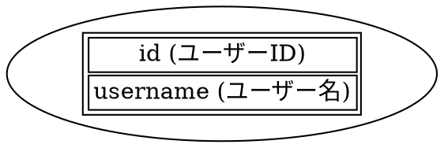
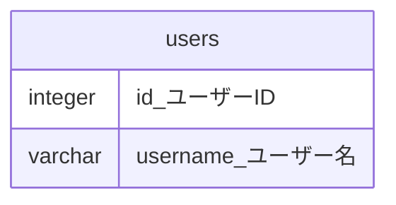

# 論理名機能ドキュメント

## 概要

論理名機能は、データベースのテーブル・カラムドキュメントに、物理名と並んで論理名（日本語やローカル言語の名前）を表示する機能です。

## 機能説明

### 基本機能

1. **論理名カラムの表示**
   - テーブルドキュメントに「Logical Name」カラムを追加
   - 物理名（Name）と並べて表示

2. **コメント分割機能**
   - データベースのコメントを区切り文字で分割
   - 前半部分を論理名、後半部分をコメントとして表示

3. **設定による制御**
   - 設定ファイルで機能の有効/無効を制御
   - 区切り文字のカスタマイズ可能

### 対応フォーマット

- **Markdown**: 独立したカラムとして表示
- **DOT**: 物理名の後に括弧内で表示 `name (logical_name)`
- **PlantUML**: 物理名の後に括弧内で表示 `name (logical_name)`
- **Mermaid**: 物理名の後にアンダースコアで結合 `name_logical_name`

## 設定方法

### 基本設定

`.tbls.yml`ファイルに以下の設定を追加：

```yaml
format:
  logicalName:
    enabled: true           # 論理名機能を有効化
    delimiter: "|"          # 区切り文字（デフォルト: "|"）
    fallbackToName: true    # 論理名がない場合に物理名を使用
```

### コメント設定

データベースのコメントを設定ファイルで定義：

```yaml
comments:
  - table: users
    tableComment: "ユーザー情報テーブル"
    columnComments:
      id: "ユーザーID|Unique identifier for users"
      username: "ユーザー名|User display name"
      email: "メールアドレス|User email address"
```

## 使用例

### 入力（データベースコメント）

```sql
-- テーブル: users
-- カラム: id のコメント: "ユーザーID|Unique identifier for users"
-- カラム: username のコメント: "ユーザー名|User display name"
```

### 出力（Markdown）

論理名機能が**有効**の場合：

| Name     | Logical Name | Type        | Default | Nullable | Comment                     |
|----------|--------------|-------------|---------|----------|----------------------------|
| id       | ユーザーID      | integer     |         | false    | Unique identifier for users |
| username | ユーザー名      | varchar(50) |         | false    | User display name          |

論理名機能が**無効**の場合：

| Name     | Type        | Default | Nullable | Comment                              |
|----------|-------------|---------|----------|--------------------------------------|
| id       | integer     |         | false    | ユーザーID\|Unique identifier for users |
| username | varchar(50) |         | false    | ユーザー名\|User display name           |

### 出力（DOT）



### 出力（Mermaid）



## 実装詳細

### 設定処理

1. **設定読み込み**: `config/config.go`で論理名設定を読み込み
2. **機能判定**: `IsLogicalNameEnabled()`で機能の有効/無効を判定
3. **区切り文字取得**: `LogicalNameDelimiter()`で区切り文字を取得

### コメント分割処理

1. **分割実行**: `schema.Column.SetLogicalNameFromComment()`でコメントを分割
2. **論理名設定**: 分割した前半部分を`LogicalName`フィールドに設定
3. **コメント更新**: 分割した後半部分を`Comment`フィールドに更新

### 出力処理

1. **Markdown**: `output/md/md.go`で論理名カラムを追加
2. **DOT**: `output/dot/templates/table.dot.tmpl`で括弧内表示
3. **PlantUML**: `output/plantuml/templates/table.puml.tmpl`で括弧内表示
4. **Mermaid**: `output/mermaid/templates/table.mermaid.tmpl`でアンダースコア結合

## フォールバック機能

論理名が設定されていない場合の動作：

1. **fallbackToName: true**: 物理名を論理名として使用
2. **fallbackToName: false**: 論理名を空文字として表示

## 制限事項

1. **区切り文字の制限**: 区切り文字はコメント内で一意である必要があります
2. **フォーマット固有の制限**: 
   - Mermaidではスペースが使用できないため、アンダースコアで結合
   - DOT・PlantUMLでは括弧内表示のため、括弧文字の扱いに注意
3. **データベース固有の制限**: 各データベースのコメント機能に依存

## トラブルシューティング

### 論理名が表示されない

1. **設定確認**: `format.logicalName.enabled`が`true`になっているか確認
2. **区切り文字確認**: コメント内に設定した区切り文字が含まれているか確認
3. **コメント設定確認**: `comments`セクションで該当テーブル・カラムが設定されているか確認

### 文字化けが発生する

1. **文字エンコーディング**: 設定ファイルがUTF-8で保存されているか確認
2. **データベース設定**: データベースの文字エンコーディング設定を確認

### 出力フォーマットで論理名が正しく表示されない

1. **テンプレート確認**: 該当フォーマットのテンプレートが更新されているか確認
2. **特殊文字**: 論理名に特殊文字が含まれている場合の処理を確認

## 関連ファイル

- `config/config.go`: 設定の読み込み・管理
- `schema/column.go`: 論理名の保存・取得
- `output/md/md.go`: Markdown出力の実装
- `output/dot/templates/table.dot.tmpl`: DOT出力テンプレート
- `output/plantuml/templates/table.puml.tmpl`: PlantUML出力テンプレート
- `output/mermaid/templates/table.mermaid.tmpl`: Mermaid出力テンプレート
- `integration_test.go`: 統合テスト

## 更新履歴

- v1.0.0: 論理名機能の基本実装
- v1.1.0: 全出力フォーマットの対応
- v1.2.0: 統合テストの追加