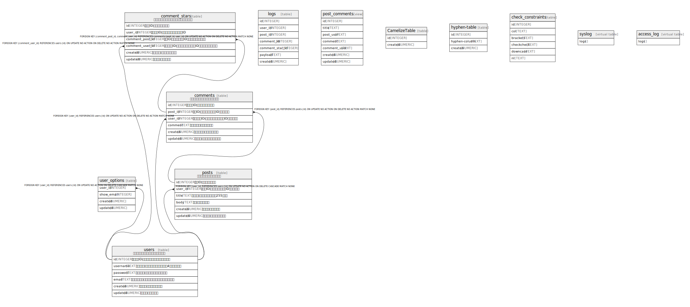

# testdb.sqlite3

## テーブル一覧

| 名前 | カラム一覧 | コメント | データ型 |
| ---- | ------- | ------- | ---- |
| [users](users.md) | 6 | ユーザー情報を管理するマスターテーブル | table |
| [user_options](user_options.md) | 4 |  | table |
| [posts](posts.md) | 6 | ブログ投稿を管理するテーブル | table |
| [comments](comments.md) | 6 | 投稿へのコメントを管理するテーブル | table |
| [comment_stars](comment_stars.md) | 6 | コメントへのスター（いいね）を管理するテーブル | table |
| [logs](logs.md) | 7 |  | table |
| [post_comments](post_comments.md) | 7 |  | view |
| [CamelizeTable](CamelizeTable.md) | 2 |  | table |
| [hyphen-table](hyphen-table.md) | 3 |  | table |
| [check_constraints](check_constraints.md) | 6 |  | table |
| [syslog](syslog.md) | 1 |  | virtual table |
| [access_log](access_log.md) | 1 |  | virtual table |

## Relations

---

> Generated by [tbls](https://github.com/k1LoW/tbls)
