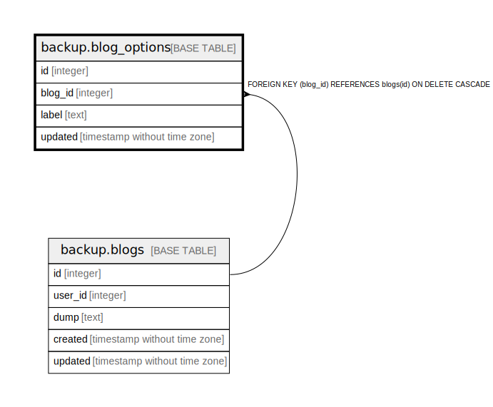

# backup.blog_options

## 概要

## カラム一覧

| 名前 | 論理名 | データ型 | デフォルト値 | NULL許可 | 子テーブル | 親テーブル | コメント |
| ---- | ------ | -------- | ------------ | -------- | ---------- | ---------- | -------- |
| id | id | integer | nextval('blog_options_id_seq'::regclass) | false |  |  |  |
| blog_id | blog_id | integer |  | false |  | [backup.blogs](backup.blogs.md) |  |
| label | label | text |  | true |  |  |  |
| updated | updated | timestamp without time zone |  | true |  |  |  |

## 制約一覧

| 名前 | データ型 | Definition |
| ---- | ---- | ---------- |
| blog_options_blog_id_fk | FOREIGN KEY | FOREIGN KEY (blog_id) REFERENCES blogs(id) ON DELETE CASCADE |
| blog_options_pkey | PRIMARY KEY | PRIMARY KEY (id) |

## インデックス一覧

| 名前 | Definition |
| ---- | ---------- |
| blog_options_pkey | CREATE UNIQUE INDEX blog_options_pkey ON backup.blog_options USING btree (id) |

## Relations

---

> Generated by [tbls](https://github.com/k1LoW/tbls)
