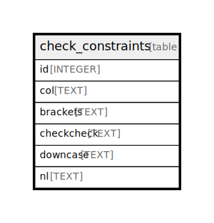

# check_constraints

## 概要

<details>
<summary><strong>Table Definition</strong></summary>

```sql
CREATE TABLE check_constraints (
  id INTEGER PRIMARY KEY AUTOINCREMENT,
  col TEXT CHECK(length(col) > 4),
  brackets TEXT UNIQUE NOT NULL CHECK(((length(brackets) > 4))),
  checkcheck TEXT UNIQUE NOT NULL CHECK(length(checkcheck) > 4),
  downcase TEXT UNIQUE NOT NULL check(length(downcase) > 4),
  nl TEXT UNIQUE NOT
    NULL check(length(nl) > 4 OR
      nl != 'ln')
)
```

</details>

## カラム一覧

| 名前 | 論理名 | データ型 | デフォルト値 | NULL許可 | 子テーブル | 親テーブル | コメント |
| ---- | ------ | -------- | ------------ | -------- | ---------- | ---------- | -------- |
| id | id | INTEGER |  | true |  |  |  |
| col | col | TEXT |  | true |  |  |  |
| brackets | brackets | TEXT |  | false |  |  |  |
| checkcheck | checkcheck | TEXT |  | false |  |  |  |
| downcase | downcase | TEXT |  | false |  |  |  |
| nl | nl | TEXT |  | false |  |  |  |

## 制約一覧

| 名前 | データ型 | Definition |
| ---- | ---- | ---------- |
| id | PRIMARY KEY | PRIMARY KEY (id) |
| sqlite_autoindex_check_constraints_4 | UNIQUE | UNIQUE (nl) |
| sqlite_autoindex_check_constraints_3 | UNIQUE | UNIQUE (downcase) |
| sqlite_autoindex_check_constraints_2 | UNIQUE | UNIQUE (checkcheck) |
| sqlite_autoindex_check_constraints_1 | UNIQUE | UNIQUE (brackets) |
| - | CHECK | CHECK(length(col) > 4) |
| - | CHECK | CHECK(((length(brackets) > 4))) |
| - | CHECK | CHECK(length(checkcheck) > 4) |
| - | CHECK | check(length(downcase) > 4) |
| - | CHECK | check(length(nl) > 4 OR nl != 'ln') |

## インデックス一覧

| 名前 | Definition |
| ---- | ---------- |
| sqlite_autoindex_check_constraints_4 | UNIQUE (nl) |
| sqlite_autoindex_check_constraints_3 | UNIQUE (downcase) |
| sqlite_autoindex_check_constraints_2 | UNIQUE (checkcheck) |
| sqlite_autoindex_check_constraints_1 | UNIQUE (brackets) |

## Relations



---

> Generated by [tbls](https://github.com/k1LoW/tbls)
