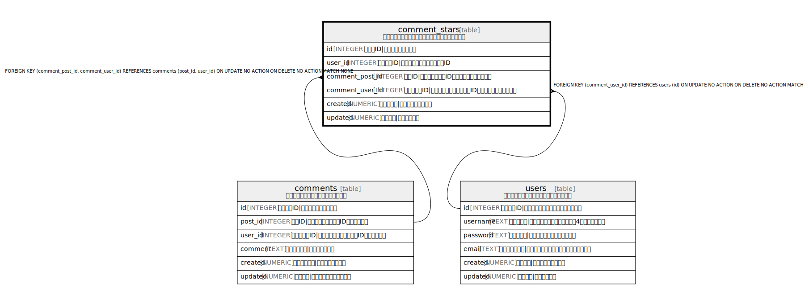

# comment_stars

## 概要

コメントへのスター（いいね）を管理するテーブル

<details>
<summary><strong>Table Definition</strong></summary>

```sql
CREATE TABLE comment_stars (
  id INTEGER PRIMARY KEY AUTOINCREMENT,
  user_id INTEGER NOT NULL,
  comment_post_id INTEGER NOT NULL,
  comment_user_id INTEGER NOT NULL,
  created NUMERIC NOT NULL,
  updated NUMERIC,
  CONSTRAINT comment_stars_user_id_post_id_fk FOREIGN KEY(comment_post_id, comment_user_id) REFERENCES comments(post_id, user_id),
  CONSTRAINT comment_stars_user_id_fk FOREIGN KEY(comment_user_id) REFERENCES users(id),
  UNIQUE(user_id, comment_post_id, comment_user_id)
)
```

</details>

## カラム一覧

| 名前 | 論理名 | データ型 | デフォルト値 | NULL許可 | 子テーブル | 親テーブル | コメント |
| ---- | ------ | -------- | ------------ | -------- | ---------- | ---------- | -------- |
| id | id | INTEGER |  | true |  |  | スターID\|スターの一意識別子 |
| user_id | user_id | INTEGER |  | false |  |  | ユーザーID\|スターを付けたユーザーのID |
| comment_post_id | comment_post_id | INTEGER |  | false |  | [comments](comments.md) | 投稿ID\|コメントの投稿ID（複合外部キーの一部） |
| comment_user_id | comment_user_id | INTEGER |  | false |  | [users](users.md) [comments](comments.md) | コメント者ID\|コメントしたユーザーのID（複合外部キーの一部） |
| created | created | NUMERIC |  | false |  |  | スター日時\|スターを付けた日時 |
| updated | updated | NUMERIC |  | true |  |  | 更新日時\|最終更新日時 |

## 制約一覧

| 名前 | データ型 | Definition |
| ---- | ---- | ---------- |
| id | PRIMARY KEY | PRIMARY KEY (id) |
| - (Foreign key ID: 0) | FOREIGN KEY | FOREIGN KEY (comment_user_id) REFERENCES users (id) ON UPDATE NO ACTION ON DELETE NO ACTION MATCH NONE |
| - (Foreign key ID: 1) | FOREIGN KEY | FOREIGN KEY (comment_post_id, comment_user_id) REFERENCES comments (post_id, user_id) ON UPDATE NO ACTION ON DELETE NO ACTION MATCH NONE |
| sqlite_autoindex_comment_stars_1 | UNIQUE | UNIQUE (user_id, comment_post_id, comment_user_id) |

## インデックス一覧

| 名前 | Definition |
| ---- | ---------- |
| sqlite_autoindex_comment_stars_1 | UNIQUE (user_id, comment_post_id, comment_user_id) |

## Relations



---

> Generated by [tbls](https://github.com/k1LoW/tbls)
