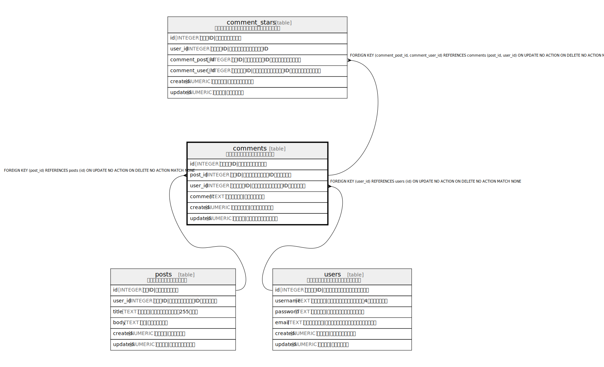

# comments

## 概要

投稿へのコメントを管理するテーブル

<details>
<summary><strong>Table Definition</strong></summary>

```sql
CREATE TABLE comments (
  id INTEGER PRIMARY KEY AUTOINCREMENT,
  post_id INTEGER NOT NULL,
  user_id INTEGER NOT NULL,
  comment TEXT NOT NULL,
  created NUMERIC NOT NULL,
  updated NUMERIC,
  CONSTRAINT comments_post_id_fk FOREIGN KEY(post_id) REFERENCES posts(id),
  CONSTRAINT comments_user_id_fk FOREIGN KEY(user_id) REFERENCES users(id),
  UNIQUE(post_id, user_id)
)
```

</details>

## カラム一覧

| 名前 | 論理名 | データ型 | デフォルト値 | NULL許可 | 子テーブル | 親テーブル | コメント |
| ---- | ------ | -------- | ------------ | -------- | ---------- | ---------- | -------- |
| id | id | INTEGER |  | true |  |  | コメントID\|コメントの一意識別子 |
| post_id | post_id | INTEGER |  | false | [comment_stars](comment_stars.md) | [posts](posts.md) | 投稿ID\|コメント対象の投稿ID（外部キー） |
| user_id | user_id | INTEGER |  | false | [comment_stars](comment_stars.md) | [users](users.md) | コメント者ID\|コメントしたユーザーのID（外部キー） |
| comment | comment | TEXT |  | false |  |  | コメント内容\|コメントの本文 |
| created | created | NUMERIC |  | false |  |  | コメント日時\|コメント投稿日時 |
| updated | updated | NUMERIC |  | true |  |  | 更新日時\|コメントの最終更新日時 |

## 制約一覧

| 名前 | データ型 | Definition |
| ---- | ---- | ---------- |
| id | PRIMARY KEY | PRIMARY KEY (id) |
| - (Foreign key ID: 0) | FOREIGN KEY | FOREIGN KEY (user_id) REFERENCES users (id) ON UPDATE NO ACTION ON DELETE NO ACTION MATCH NONE |
| - (Foreign key ID: 1) | FOREIGN KEY | FOREIGN KEY (post_id) REFERENCES posts (id) ON UPDATE NO ACTION ON DELETE NO ACTION MATCH NONE |
| sqlite_autoindex_comments_1 | UNIQUE | UNIQUE (post_id, user_id) |

## インデックス一覧

| 名前 | Definition |
| ---- | ---------- |
| comments_post_id_user_id_idx | CREATE INDEX comments_post_id_user_id_idx ON comments(post_id, user_id) |
| sqlite_autoindex_comments_1 | UNIQUE (post_id, user_id) |

## Relations



---

> Generated by [tbls](https://github.com/k1LoW/tbls)
