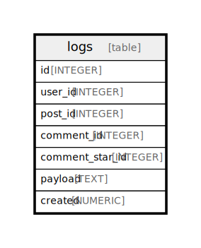

# logs

## 概要

<details>
<summary><strong>Table Definition</strong></summary>

```sql
CREATE TABLE logs (
  id INTEGER PRIMARY KEY AUTOINCREMENT,
  user_id INTEGER NOT NULL,
  post_id INTEGER,
  comment_id INTEGER,
  comment_star_id INTEGER,
  payload TEXT,
  created NUMERIC NOT NULL
)
```

</details>

## カラム一覧

| 名前 | 論理名 | データ型 | デフォルト値 | NULL許可 | 子テーブル | 親テーブル | コメント |
| ---- | ------ | -------- | ------------ | -------- | ---------- | ---------- | -------- |
| id | id | INTEGER |  | true |  |  |  |
| user_id | user_id | INTEGER |  | false |  |  |  |
| post_id | post_id | INTEGER |  | true |  |  |  |
| comment_id | comment_id | INTEGER |  | true |  |  |  |
| comment_star_id | comment_star_id | INTEGER |  | true |  |  |  |
| payload | payload | TEXT |  | true |  |  |  |
| created | created | NUMERIC |  | false |  |  |  |

## 制約一覧

| 名前 | データ型 | Definition |
| ---- | ---- | ---------- |
| id | PRIMARY KEY | PRIMARY KEY (id) |

## Relations



---

> Generated by [tbls](https://github.com/k1LoW/tbls)
