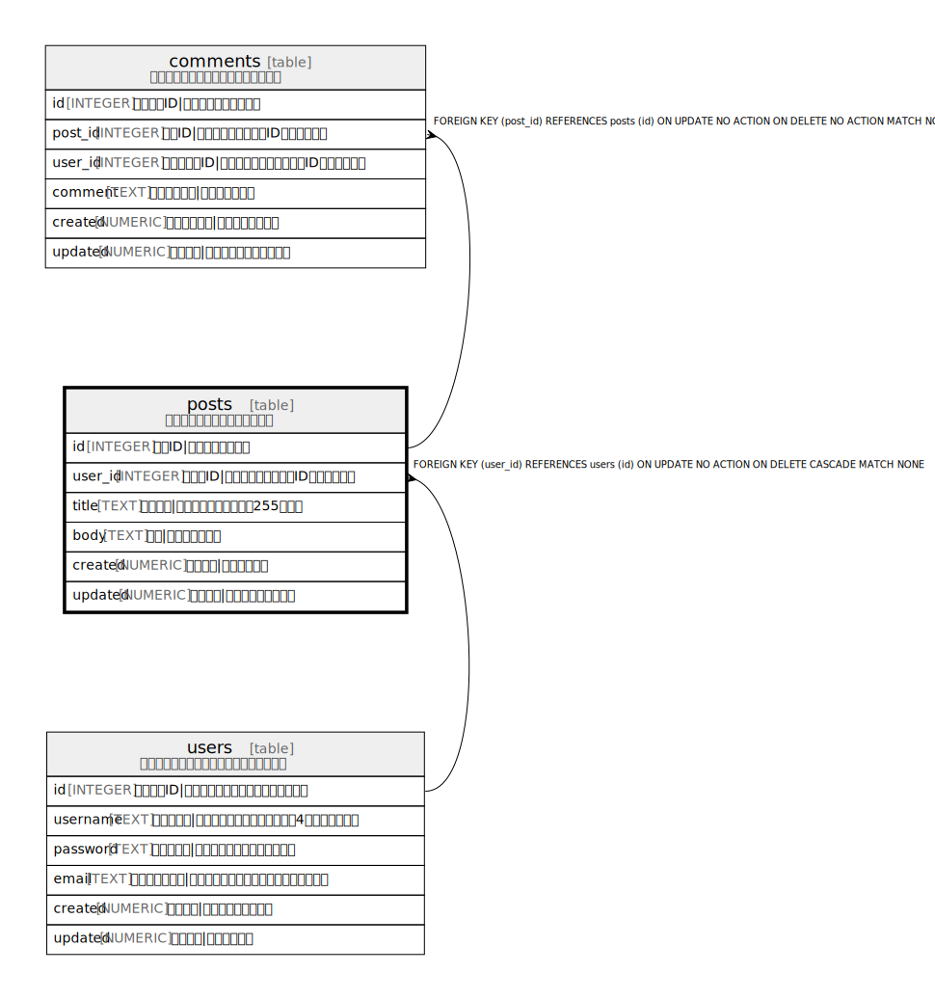

# posts

## 概要

ブログ投稿を管理するテーブル

<details>
<summary><strong>Table Definition</strong></summary>

```sql
CREATE TABLE posts (
  id INTEGER PRIMARY KEY AUTOINCREMENT,
  user_id INTEGER NOT NULL,
  title TEXT NOT NULL,
  body TEXT NOT NULL,
  created NUMERIC NOT NULL,
  updated NUMERIC,
  CONSTRAINT posts_user_id_fk FOREIGN KEY(user_id) REFERENCES users(id) MATCH NONE ON UPDATE NO ACTION ON DELETE CASCADE
)
```

</details>

## カラム一覧

| 名前 | 論理名 | データ型 | デフォルト値 | NULL許可 | 子テーブル | 親テーブル | コメント |
| ---- | ------ | -------- | ------------ | -------- | ---------- | ---------- | -------- |
| id | id | INTEGER |  | true | [comments](comments.md) |  | 投稿ID\|投稿の一意識別子 |
| user_id | user_id | INTEGER |  | false |  | [users](users.md) | 投稿者ID\|投稿したユーザーのID（外部キー） |
| title | title | TEXT |  | false |  |  | タイトル\|投稿のタイトル（最大255文字） |
| body | body | TEXT |  | false |  |  | 本文\|投稿の本文内容 |
| created | created | NUMERIC |  | false |  |  | 投稿日時\|投稿作成日時 |
| updated | updated | NUMERIC |  | true |  |  | 更新日時\|投稿の最終更新日時 |

## 制約一覧

| 名前 | データ型 | Definition |
| ---- | ---- | ---------- |
| id | PRIMARY KEY | PRIMARY KEY (id) |
| - (Foreign key ID: 0) | FOREIGN KEY | FOREIGN KEY (user_id) REFERENCES users (id) ON UPDATE NO ACTION ON DELETE CASCADE MATCH NONE |

## インデックス一覧

| 名前 | Definition |
| ---- | ---------- |
| posts_user_id_idx | CREATE INDEX posts_user_id_idx ON posts(user_id) |

## Triggers

| 名前 | Definition |
| ---- | ---------- |
| update_posts_updated | CREATE TRIGGER update_posts_updated AFTER UPDATE ON posts FOR EACH ROW<br>BEGIN<br>  UPDATE posts SET updated = current_timestamp WHERE id = OLD.id;<br>END |

## Relations



---

> Generated by [tbls](https://github.com/k1LoW/tbls)
