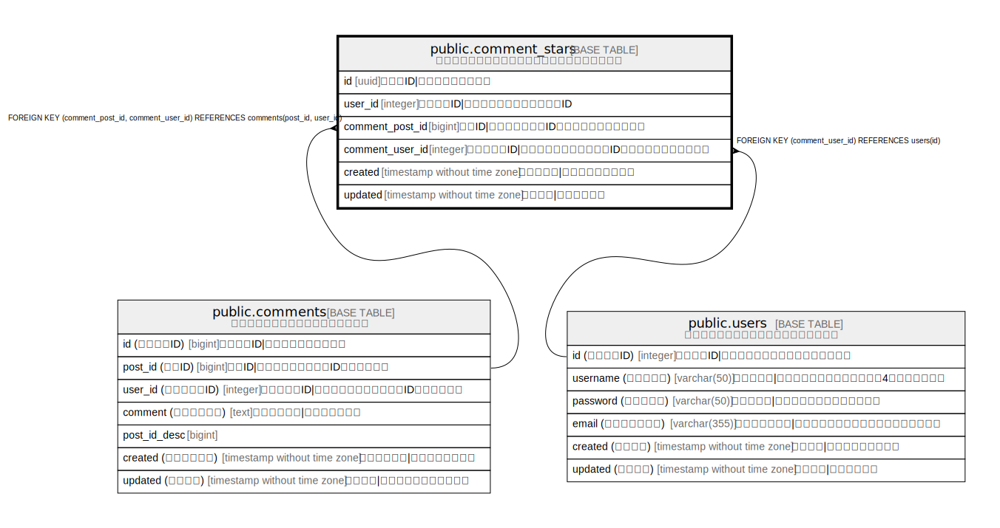

# public.comment_stars

## 概要

コメントへのスター（いいね）を管理するテーブル

## カラム一覧

| 名前 | 論理名 | データ型 | デフォルト値 | NULL許可 | 子テーブル | 親テーブル | コメント |
| ---- | ------ | -------- | ------------ | -------- | ---------- | ---------- | -------- |
| id | id | uuid | uuid_generate_v4() | false |  |  | スターID\|スターの一意識別子 |
| user_id | user_id | integer |  | false |  |  | ユーザーID\|スターを付けたユーザーのID |
| comment_post_id | comment_post_id | bigint |  | false |  | [public.comments](public.comments.md) | 投稿ID\|コメントの投稿ID（複合外部キーの一部） |
| comment_user_id | comment_user_id | integer |  | false |  | [public.users](public.users.md) [public.comments](public.comments.md) | コメント者ID\|コメントしたユーザーのID（複合外部キーの一部） |
| created | created | timestamp without time zone |  | false |  |  | スター日時\|スターを付けた日時 |
| updated | updated | timestamp without time zone |  | true |  |  | 更新日時\|最終更新日時 |

## 制約一覧

| 名前 | データ型 | Definition |
| ---- | ---- | ---------- |
| comment_stars_user_id_fk | FOREIGN KEY | FOREIGN KEY (comment_user_id) REFERENCES users(id) |
| comment_stars_user_id_post_id_fk | FOREIGN KEY | FOREIGN KEY (comment_post_id, comment_user_id) REFERENCES comments(post_id, user_id) |
| comment_stars_user_id_comment_post_id_comment_user_id_key | UNIQUE | UNIQUE (user_id, comment_post_id, comment_user_id) |

## インデックス一覧

| 名前 | Definition |
| ---- | ---------- |
| comment_stars_user_id_comment_post_id_comment_user_id_key | CREATE UNIQUE INDEX comment_stars_user_id_comment_post_id_comment_user_id_key ON public.comment_stars USING btree (user_id, comment_post_id, comment_user_id) |

## Relations

---

> Generated by [tbls](https://github.com/k1LoW/tbls)
