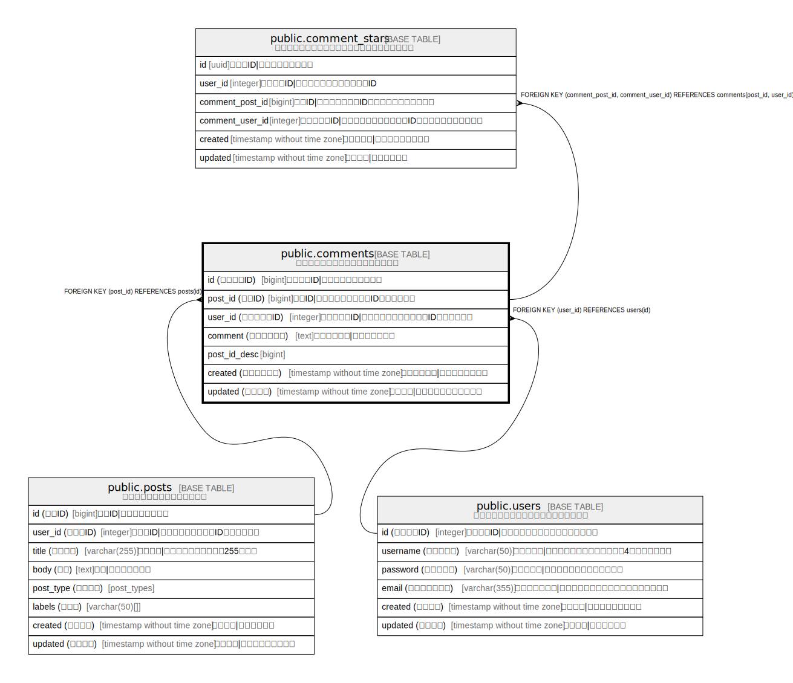

# public.comments

## 概要

投稿へのコメントを管理するテーブル

## カラム一覧

| 名前 | 論理名 | データ型 | デフォルト値 | NULL許可 | Extra Definition | 子テーブル | 親テーブル | コメント |
| ---- | ------ | -------- | ------------ | -------- | ---------------- | ---------- | ---------- | -------- |
| id | コメントID | bigint | nextval('comments_id_seq'::regclass) | false |  |  |  | コメントID\|コメントの一意識別子 |
| post_id | 投稿ID | bigint |  | false |  | [public.comment_stars](public.comment_stars.md) | [public.posts](public.posts.md) | 投稿ID\|コメント対象の投稿ID（外部キー） |
| user_id | コメント者ID | integer |  | false |  | [public.comment_stars](public.comment_stars.md) | [public.users](public.users.md) | コメント者ID\|コメントしたユーザーのID（外部キー） |
| comment | コメント内容 | text |  | false |  |  |  | コメント内容\|コメントの本文 |
| post_id_desc | post_id_desc | bigint |  | true | GENERATED ALWAYS AS (post_id * '-1'::integer) STORED |  |  |  |
| created | コメント日時 | timestamp without time zone |  | false |  |  |  | コメント日時\|コメント投稿日時 |
| updated | 更新日時 | timestamp without time zone |  | true |  |  |  | 更新日時\|コメントの最終更新日時 |

## 制約一覧

| 名前 | データ型 | Definition |
| ---- | ---- | ---------- |
| comments_user_id_fk | FOREIGN KEY | FOREIGN KEY (user_id) REFERENCES users(id) |
| comments_post_id_fk | FOREIGN KEY | FOREIGN KEY (post_id) REFERENCES posts(id) |
| comments_id_pk | PRIMARY KEY | PRIMARY KEY (id) |
| comments_post_id_user_id_key | UNIQUE | UNIQUE (post_id, user_id) |

## インデックス一覧

| 名前 | Definition |
| ---- | ---------- |
| comments_id_pk | CREATE UNIQUE INDEX comments_id_pk ON public.comments USING btree (id) |
| comments_post_id_user_id_key | CREATE UNIQUE INDEX comments_post_id_user_id_key ON public.comments USING btree (post_id, user_id) |
| comments_post_id_user_id_idx | CREATE INDEX comments_post_id_user_id_idx ON public.comments USING btree (post_id, user_id) |

## Relations

---

> Generated by [tbls](https://github.com/k1LoW/tbls)
