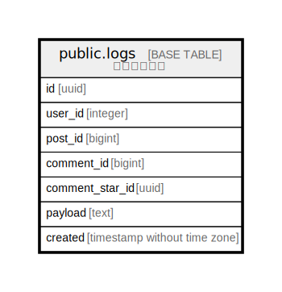

# public.logs

## 概要

システムログ

## カラム一覧

| 名前 | 論理名 | データ型 | デフォルト値 | NULL許可 | 子テーブル | 親テーブル | コメント |
| ---- | ------ | -------- | ------------ | -------- | ---------- | ---------- | -------- |
| id | id | uuid | uuid_generate_v4() | false |  |  |  |
| user_id | user_id | integer |  | false |  |  |  |
| post_id | post_id | bigint |  | true |  |  |  |
| comment_id | comment_id | bigint |  | true |  |  |  |
| comment_star_id | comment_star_id | uuid |  | true |  |  |  |
| payload | payload | text |  | true |  |  |  |
| created | created | timestamp without time zone |  | false |  |  |  |

## Relations

---

> Generated by [tbls](https://github.com/k1LoW/tbls)
