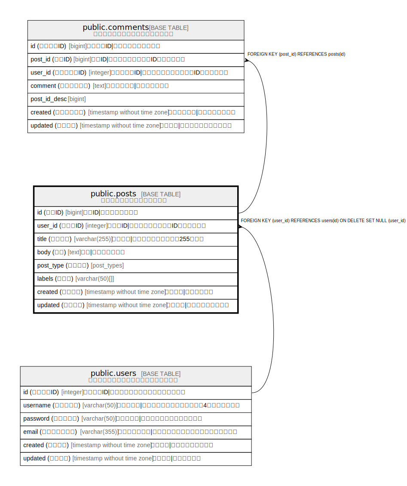

# public.posts

## 概要

ブログ投稿を管理するテーブル

## カラム一覧

| 名前 | 論理名 | データ型 | デフォルト値 | NULL許可 | 子テーブル | 親テーブル | コメント |
| ---- | ------ | -------- | ------------ | -------- | ---------- | ---------- | -------- |
| id | 投稿ID | bigint | nextval('posts_id_seq'::regclass) | false | [public.comments](public.comments.md) |  | 投稿ID\|投稿の一意識別子 |
| user_id | 投稿者ID | integer |  | false |  | [public.users](public.users.md) | 投稿者ID\|投稿したユーザーのID（外部キー） |
| title | タイトル | varchar(255) | 'Untitled'::character varying | false |  |  | タイトル\|投稿のタイトル（最大255文字） |
| body | 本文 | text |  | false |  |  | 本文\|投稿の本文内容 |
| post_type | 投稿種別 | post_types |  | false |  |  |  |
| labels | ラベル | varchar(50)[] |  | true |  |  |  |
| created | 投稿日時 | timestamp without time zone |  | false |  |  | 投稿日時\|投稿作成日時 |
| updated | 更新日時 | timestamp without time zone |  | true |  |  | 更新日時\|投稿の最終更新日時 |

## 制約一覧

| 名前 | データ型 | Definition | コメント |
| ---- | ---- | ---------- | ------- |
| update_posts_updated | TRIGGER | CREATE CONSTRAINT TRIGGER update_posts_updated AFTER INSERT OR UPDATE ON public.posts NOT DEFERRABLE INITIALLY IMMEDIATE FOR EACH ROW EXECUTE FUNCTION update_updated() |  |
| posts_user_id_fk | FOREIGN KEY | FOREIGN KEY (user_id) REFERENCES users(id) ON DELETE SET NULL (user_id) | posts -> users |
| posts_id_pk | PRIMARY KEY | PRIMARY KEY (id) |  |
| posts_user_id_title_key | UNIQUE | UNIQUE (user_id, title) |  |

## インデックス一覧

| 名前 | Definition | コメント |
| ---- | ---------- | ------- |
| posts_id_pk | CREATE UNIQUE INDEX posts_id_pk ON public.posts USING btree (id) |  |
| posts_user_id_title_key | CREATE UNIQUE INDEX posts_user_id_title_key ON public.posts USING btree (user_id, title) |  |
| posts_user_id_idx | CREATE INDEX posts_user_id_idx ON public.posts USING btree (user_id) | posts.user_id index |

## Triggers

| 名前 | Definition |
| ---- | ---------- |
| update_posts_updated | CREATE CONSTRAINT TRIGGER update_posts_updated AFTER INSERT OR UPDATE ON public.posts NOT DEFERRABLE INITIALLY IMMEDIATE FOR EACH ROW EXECUTE FUNCTION update_updated() |

## Relations

---

> Generated by [tbls](https://github.com/k1LoW/tbls)
