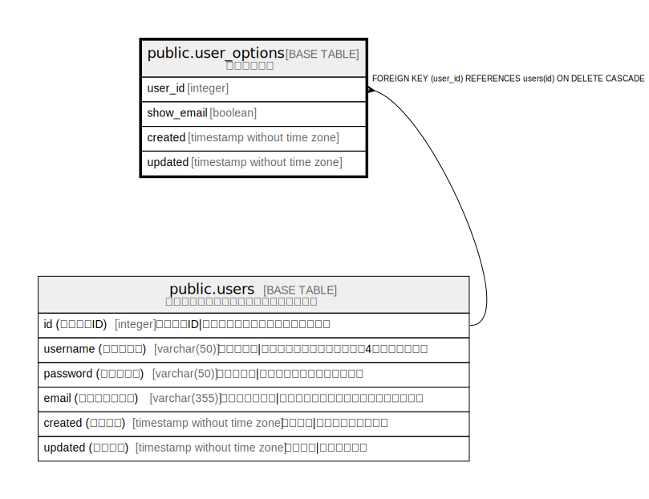

# public.user_options

## 概要

ユーザー設定

## カラム一覧

| 名前 | 論理名 | データ型 | デフォルト値 | NULL許可 | 子テーブル | 親テーブル | コメント |
| ---- | ------ | -------- | ------------ | -------- | ---------- | ---------- | -------- |
| user_id | user_id | integer |  | false |  | [public.users](public.users.md) |  |
| show_email | show_email | boolean | false | false |  |  |  |
| created | created | timestamp without time zone |  | false |  |  |  |
| updated | updated | timestamp without time zone |  | true |  |  |  |

## 制約一覧

| 名前 | データ型 | Definition |
| ---- | ---- | ---------- |
| user_options_user_id_fk | FOREIGN KEY | FOREIGN KEY (user_id) REFERENCES users(id) ON DELETE CASCADE |
| user_options_pkey | PRIMARY KEY | PRIMARY KEY (user_id) |

## インデックス一覧

| 名前 | Definition |
| ---- | ---------- |
| user_options_pkey | CREATE UNIQUE INDEX user_options_pkey ON public.user_options USING btree (user_id) |

## Relations

---

> Generated by [tbls](https://github.com/k1LoW/tbls)
