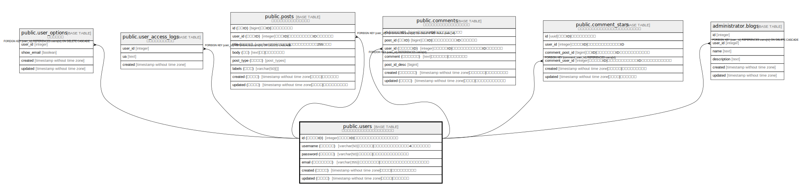

# public.users

## 概要

ユーザー情報を管理するマスターテーブル

## カラム一覧

| 名前 | 論理名 | データ型 | デフォルト値 | NULL許可 | 子テーブル | 親テーブル | コメント |
| ---- | ------ | -------- | ------------ | -------- | ---------- | ---------- | -------- |
| id | ユーザーID | integer | nextval('users_id_seq'::regclass) | false | [public.user_options](public.user_options.md) [public.user_access_logs](public.user_access_logs.md) [public.posts](public.posts.md) [public.comments](public.comments.md) [public.comment_stars](public.comment_stars.md) [administrator.blogs](administrator.blogs.md) |  | ユーザーID\|システム内で一意のユーザー識別子 |
| username | ユーザー名 | varchar(50) |  | false |  |  | ユーザー名\|ログイン時に使用する名前（4文字以上必須） |
| password | パスワード | varchar(50) |  | false |  |  | パスワード\|ハッシュ化されたパスワード |
| email | メールアドレス | varchar(355) |  | false |  |  | メールアドレス\|連絡用メールアドレス（一意制約あり） |
| created | 登録日時 | timestamp without time zone |  | false |  |  | 登録日時\|アカウント作成日時 |
| updated | 更新日時 | timestamp without time zone |  | true |  |  | 更新日時\|最終更新日時 |

## 制約一覧

| 名前 | データ型 | Definition |
| ---- | ---- | ---------- |
| users_username_check | CHECK | CHECK ((char_length((username)::text) > 4)) |
| users_pkey | PRIMARY KEY | PRIMARY KEY (id) |
| users_username_key | UNIQUE | UNIQUE (username) |
| users_email_key | UNIQUE | UNIQUE (email) |

## インデックス一覧

| 名前 | Definition |
| ---- | ---------- |
| users_pkey | CREATE UNIQUE INDEX users_pkey ON public.users USING btree (id) |
| users_username_key | CREATE UNIQUE INDEX users_username_key ON public.users USING btree (username) |
| users_email_key | CREATE UNIQUE INDEX users_email_key ON public.users USING btree (email) |

## Triggers

| 名前 | Definition | コメント |
| ---- | ---------- | ------- |
| update_users_updated | CREATE TRIGGER update_users_updated AFTER INSERT OR UPDATE ON public.users FOR EACH ROW EXECUTE FUNCTION update_updated() | Update updated when users insert or update |

## Relations

---

> Generated by [tbls](https://github.com/k1LoW/tbls)
