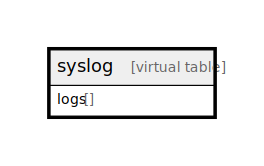

# syslog

## 概要

<details>
<summary><strong>Table Definition</strong></summary>

```sql
CREATE VIRTUAL TABLE syslog USING fts3(logs)
```

</details>

## カラム一覧

| 名前 | 論理名 | データ型 | デフォルト値 | NULL許可 | 子テーブル | 親テーブル | コメント |
| ---- | ------ | -------- | ------------ | -------- | ---------- | ---------- | -------- |
| logs | logs |  |  | true |  |  |  |

## Relations



---

> Generated by [tbls](https://github.com/k1LoW/tbls)
