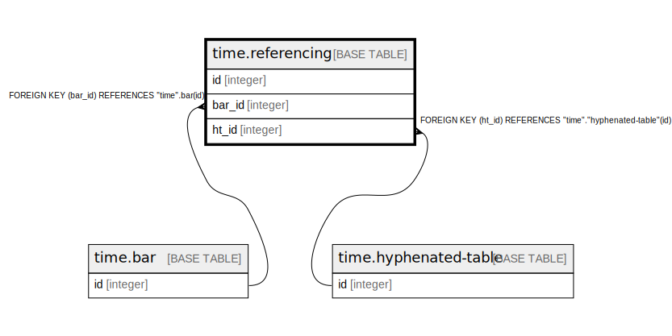

# time.referencing

## 概要

## カラム一覧

| 名前 | 論理名 | データ型 | デフォルト値 | NULL許可 | 子テーブル | 親テーブル | コメント |
| ---- | ------ | -------- | ------------ | -------- | ---------- | ---------- | -------- |
| id | id | integer |  | false |  |  |  |
| bar_id | bar_id | integer |  | false |  | [time.bar](time.bar.md) |  |
| ht_id | ht_id | integer |  | false |  | [time.hyphenated-table](time.hyphenated-table.md) |  |

## 制約一覧

| 名前 | データ型 | Definition |
| ---- | ---- | ---------- |
| referencing_bar_id | FOREIGN KEY | FOREIGN KEY (bar_id) REFERENCES "time".bar(id) |
| referencing_ht_id | FOREIGN KEY | FOREIGN KEY (ht_id) REFERENCES "time"."hyphenated-table"(id) |
| referencing_pkey | PRIMARY KEY | PRIMARY KEY (id) |

## インデックス一覧

| 名前 | Definition |
| ---- | ---------- |
| referencing_pkey | CREATE UNIQUE INDEX referencing_pkey ON "time".referencing USING btree (id) |

## Relations

---

> Generated by [tbls](https://github.com/k1LoW/tbls)
