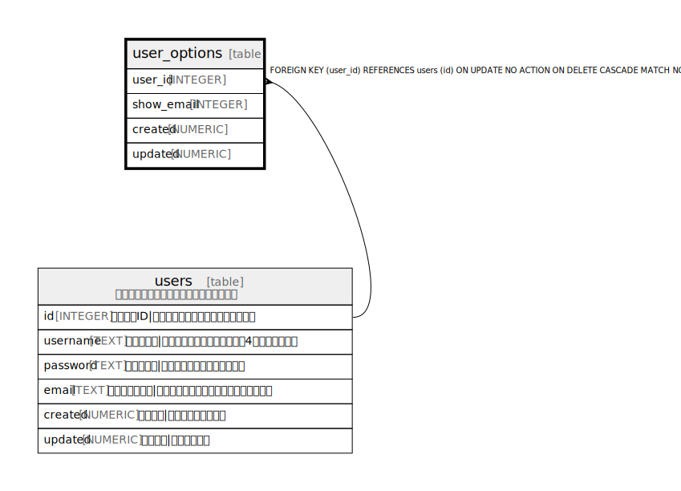

# user_options

## 概要

<details>
<summary><strong>Table Definition</strong></summary>

```sql
CREATE TABLE user_options (
  user_id INTEGER PRIMARY KEY,
  show_email INTEGER NOT NULL DEFAULT 0,
  created NUMERIC NOT NULL,
  updated NUMERIC,
  CONSTRAINT user_options_user_id_fk FOREIGN KEY(user_id) REFERENCES users(id) MATCH NONE ON UPDATE NO ACTION ON DELETE CASCADE
)
```

</details>

## カラム一覧

| 名前 | 論理名 | データ型 | デフォルト値 | NULL許可 | 子テーブル | 親テーブル | コメント |
| ---- | ------ | -------- | ------------ | -------- | ---------- | ---------- | -------- |
| user_id | user_id | INTEGER |  | true |  | [users](users.md) |  |
| show_email | show_email | INTEGER | 0 | false |  |  |  |
| created | created | NUMERIC |  | false |  |  |  |
| updated | updated | NUMERIC |  | true |  |  |  |

## 制約一覧

| 名前 | データ型 | Definition |
| ---- | ---- | ---------- |
| user_id | PRIMARY KEY | PRIMARY KEY (user_id) |
| - (Foreign key ID: 0) | FOREIGN KEY | FOREIGN KEY (user_id) REFERENCES users (id) ON UPDATE NO ACTION ON DELETE CASCADE MATCH NONE |

## Relations



---

> Generated by [tbls](https://github.com/k1LoW/tbls)
