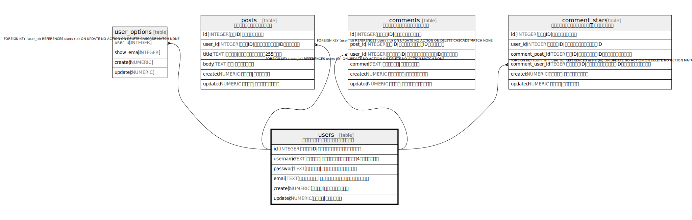

# users

## 概要

ユーザー情報を管理するマスターテーブル

<details>
<summary><strong>Table Definition</strong></summary>

```sql
CREATE TABLE users (
  id INTEGER PRIMARY KEY AUTOINCREMENT,
  username TEXT UNIQUE NOT NULL CHECK(length(username) > 4),
  password TEXT NOT NULL,
  email TEXT UNIQUE NOT NULL,
  created NUMERIC NOT NULL,
  updated NUMERIC
)
```

</details>

## カラム一覧

| 名前 | 論理名 | データ型 | デフォルト値 | NULL許可 | 子テーブル | 親テーブル | コメント |
| ---- | ------ | -------- | ------------ | -------- | ---------- | ---------- | -------- |
| id | id | INTEGER |  | true | [user_options](user_options.md) [posts](posts.md) [comments](comments.md) [comment_stars](comment_stars.md) |  | ユーザーID\|システム内で一意のユーザー識別子 |
| username | username | TEXT |  | false |  |  | ユーザー名\|ログイン時に使用する名前（4文字以上必須） |
| password | password | TEXT |  | false |  |  | パスワード\|ハッシュ化されたパスワード |
| email | email | TEXT |  | false |  |  | メールアドレス\|連絡用メールアドレス（一意制約あり） |
| created | created | NUMERIC |  | false |  |  | 登録日時\|アカウント作成日時 |
| updated | updated | NUMERIC |  | true |  |  | 更新日時\|最終更新日時 |

## 制約一覧

| 名前 | データ型 | Definition |
| ---- | ---- | ---------- |
| id | PRIMARY KEY | PRIMARY KEY (id) |
| sqlite_autoindex_users_2 | UNIQUE | UNIQUE (email) |
| sqlite_autoindex_users_1 | UNIQUE | UNIQUE (username) |
| - | CHECK | CHECK(length(username) > 4) |

## インデックス一覧

| 名前 | Definition |
| ---- | ---------- |
| users_username_key | CREATE UNIQUE INDEX users_username_key ON users(username) |
| sqlite_autoindex_users_2 | UNIQUE (email) |
| sqlite_autoindex_users_1 | UNIQUE (username) |

## Relations



---

> Generated by [tbls](https://github.com/k1LoW/tbls)
