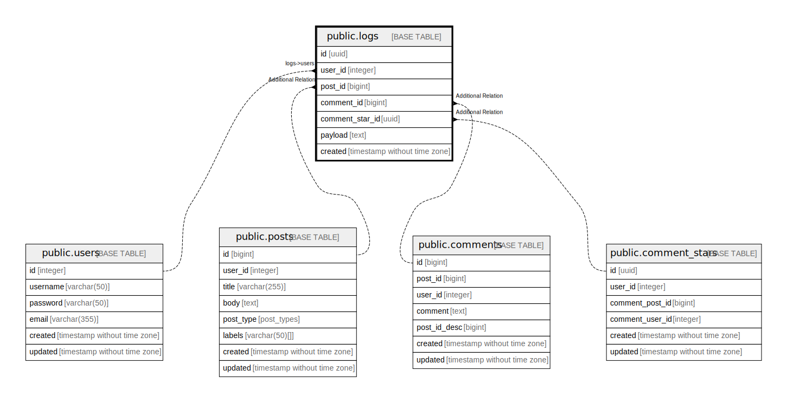

# public.logs

## Description

audit log table

## Columns

| Name            | Type                        | Default            | Nullable | Children | Parents                                         | Comment |
| --------------- | --------------------------- | ------------------ | -------- | -------- | ----------------------------------------------- | ------- |
| id              | uuid                        | uuid_generate_v4() | false    |          |                                                 |         |
| user_id         | integer                     |                    | false    |          | [public.users](public.users.md)                 |         |
| post_id         | bigint                      |                    | true     |          | [public.posts](public.posts.md)                 |         |
| comment_id      | bigint                      |                    | true     |          | [public.comments](public.comments.md)           |         |
| comment_star_id | uuid                        |                    | true     |          | [public.comment_stars](public.comment_stars.md) |         |
| payload         | text                        |                    | true     |          |                                                 |         |
| created         | timestamp without time zone |                    | false    |          |                                                 |         |

## Relations

---

> Generated by [tbls](https://github.com/k1LoW/tbls)
