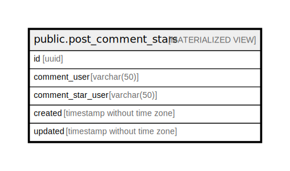

# public.post_comment_stars

## Description

<details>
<summary><strong>Table Definition</strong></summary>

```sql
CREATE MATERIALIZED VIEW post_comment_stars AS (
 SELECT cs.id,
    cu.username AS comment_user,
    csu.username AS comment_star_user,
    cs.created,
    cs.updated
   FROM (((comments c
     LEFT JOIN comment_stars cs ON (((cs.comment_post_id = c.id) AND (cs.comment_user_id = c.user_id))))
     LEFT JOIN users cu ON ((cu.id = cs.comment_user_id)))
     LEFT JOIN users csu ON ((csu.id = cs.user_id)))
)
```

</details>

## Columns

| Name              | Type                        | Default | Nullable | Children | Parents | Comment |
| ----------------- | --------------------------- | ------- | -------- | -------- | ------- | ------- |
| id                | uuid                        |         | true     |          |         |         |
| comment_user      | varchar(50)                 |         | true     |          |         |         |
| comment_star_user | varchar(50)                 |         | true     |          |         |         |
| created           | timestamp without time zone |         | true     |          |         |         |
| updated           | timestamp without time zone |         | true     |          |         |         |

## Relations



---

> Generated by [tbls](https://github.com/k1LoW/tbls)
