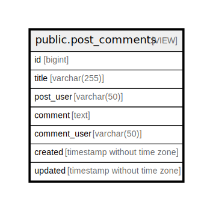

# public.post_comments

## Description

post and comments View table

<details>
<summary><strong>Table Definition</strong></summary>

```sql
CREATE VIEW post_comments AS (
 SELECT c.id,
    p.title,
    u.username AS post_user,
    c.comment,
    u2.username AS comment_user,
    c.created,
    c.updated
   FROM (((posts p
     LEFT JOIN comments c ON ((p.id = c.post_id)))
     LEFT JOIN users u ON ((u.id = p.user_id)))
     LEFT JOIN users u2 ON ((u2.id = c.user_id)))
)
```

</details>

## Columns

| Name         | Type                        | Default | Nullable | Children | Parents | Comment                 |
| ------------ | --------------------------- | ------- | -------- | -------- | ------- | ----------------------- |
| id           | bigint                      |         | true     |          |         | comments.id             |
| title        | varchar(255)                |         | true     |          |         | posts.title             |
| post_user    | varchar(50)                 |         | true     |          |         | posts.users.username    |
| comment      | text                        |         | true     |          |         |                         |
| comment_user | varchar(50)                 |         | true     |          |         | comments.users.username |
| created      | timestamp without time zone |         | true     |          |         | comments.created        |
| updated      | timestamp without time zone |         | true     |          |         | comments.updated        |

## Referenced Tables

| Name                                  | Columns | Comment                                    | Type       |
| ------------------------------------- | ------- | ------------------------------------------ | ---------- |
| [public.posts](public.posts.md)       | 8       | Posts table                                | BASE TABLE |
| [public.comments](public.comments.md) | 7       | Comments<br>Multi-line<br>table<br>comment | BASE TABLE |
| [public.users](public.users.md)       | 6       | Users table                                | BASE TABLE |

## Viewpoints

| Name                   | Definition |
| ---------------------- | ---------- |
| [post](viewpoint-0.md) | for post   |

## Relations



---

> Generated by [tbls](https://github.com/k1LoW/tbls)
