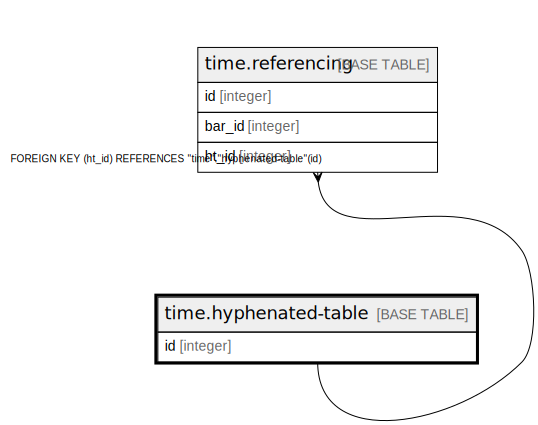

# time.hyphenated-table

## Description

## Columns

| Name | Type    | Default | Nullable | Children                                | Parents | Comment |
| ---- | ------- | ------- | -------- | --------------------------------------- | ------- | ------- |
| id   | integer |         | false    | [time.referencing](time.referencing.md) |         |         |

## Constraints

| Name                  | Type        | Definition       |
| --------------------- | ----------- | ---------------- |
| hyphenated-table_pkey | PRIMARY KEY | PRIMARY KEY (id) |

## Indexes

| Name                  | Definition                                                                                |
| --------------------- | ----------------------------------------------------------------------------------------- |
| hyphenated-table_pkey | CREATE UNIQUE INDEX "hyphenated-table_pkey" ON "time"."hyphenated-table" USING btree (id) |

## Relations

---

> Generated by [tbls](https://github.com/k1LoW/tbls)
