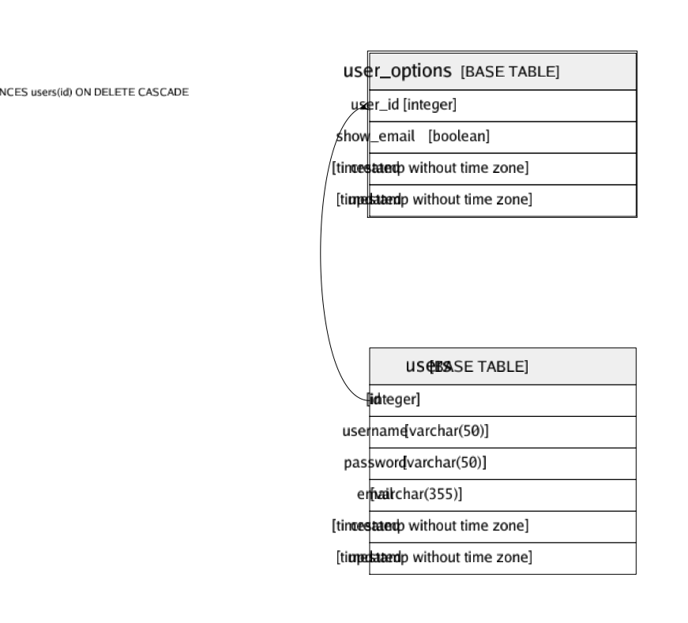

# user_options

## Description

User options table

## Columns

| Name       | Type                        | Default | Nullable | Children | Parents           | Comment |
| ---------- | --------------------------- | ------- | -------- | -------- | ----------------- | ------- |
| user_id    | integer                     |         | false    |          | [users](users.md) |         |
| show_email | boolean                     | false   | false    |          |                   |         |
| created    | timestamp without time zone |         | false    |          |                   |         |
| updated    | timestamp without time zone |         | true     |          |                   |         |

## Constraints

| Name                    | Type        | Definition                                                   |
| ----------------------- | ----------- | ------------------------------------------------------------ |
| user_options_user_id_fk | FOREIGN KEY | FOREIGN KEY (user_id) REFERENCES users(id) ON DELETE CASCADE |
| user_options_pkey       | PRIMARY KEY | PRIMARY KEY (user_id)                                        |

## Indexes

| Name              | Definition                                                                         |
| ----------------- | ---------------------------------------------------------------------------------- |
| user_options_pkey | CREATE UNIQUE INDEX user_options_pkey ON public.user_options USING btree (user_id) |

## Relations

---

> Generated by [tbls](https://github.com/k1LoW/tbls)
