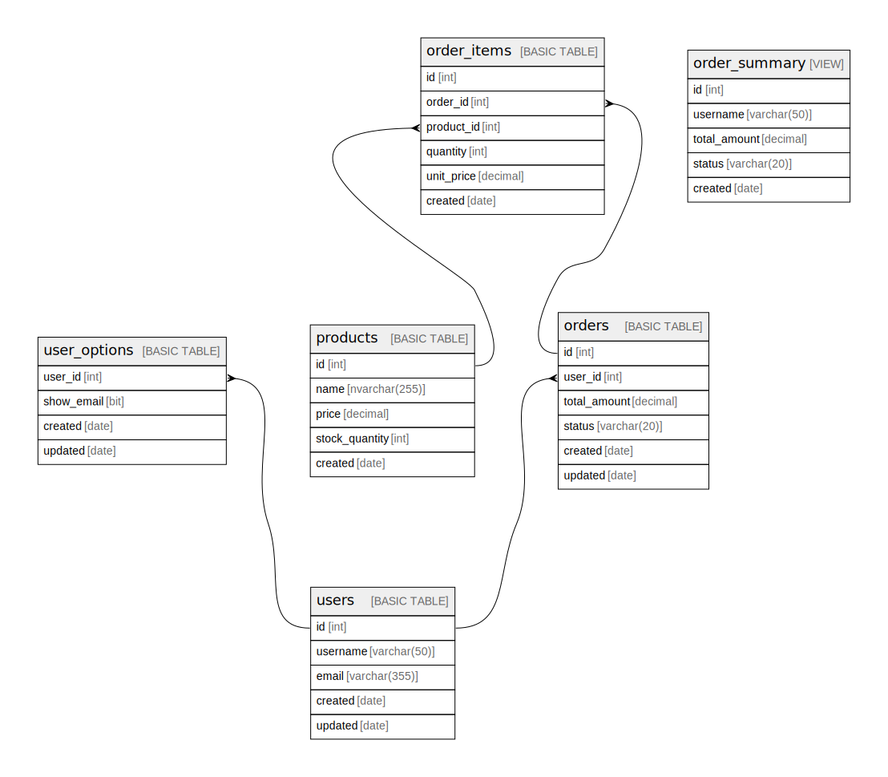

# azuresqldb

## Description

Sample Azure SQL / Microsoft Fabric Warehouse document.

## Labels

`sample` `tbls`

## Tables

| Name | Columns | Comment | Type |
| ---- | ------- | ------- | ---- |
| [users](users.md) | 5 | Users table | BASIC TABLE |
| [user_options](user_options.md) | 4 | User options table | BASIC TABLE |
| [products](products.md) | 5 | Product catalog | BASIC TABLE |
| [orders](orders.md) | 6 | Customer orders | BASIC TABLE |
| [order_items](order_items.md) | 6 |  | BASIC TABLE |
| [order_summary](order_summary.md) | 5 |  | VIEW |

## Relations

---

> Generated by [tbls](https://github.com/k1LoW/tbls)
