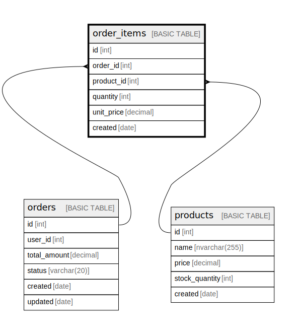

# order_items

## Columns

| Name | Type | Default | Nullable | Children | Parents | Comment |
| ---- | ---- | ------- | -------- | -------- | ------- | ------- |
| id | int |  | false |  |  |  |
| order_id | int |  | false |  | [orders](orders.md) |  |
| product_id | int |  | false |  | [products](products.md) |  |
| quantity | int |  | false |  |  |  |
| unit_price | decimal |  | false |  |  |  |
| created | date |  | false |  |  |  |

## Constraints

| Name | Type | Definition |
| ---- | ---- | ---------- |
| PK__order_it_* | PRIMARY KEY | CLUSTERED, unique, part of a PRIMARY KEY constraint, [ id ] |
| UQ__order_it_* | UNIQUE | NONCLUSTERED, unique, part of a UNIQUE constraint, [ order_id, product_id ] |
| order_items_order_id_fk | FOREIGN KEY | FOREIGN KEY(order_id) REFERENCES orders(id) ON UPDATE NO_ACTION ON DELETE CASCADE |
| order_items_product_id_fk | FOREIGN KEY | FOREIGN KEY(product_id) REFERENCES products(id) ON UPDATE NO_ACTION ON DELETE NO_ACTION |
| CK__order_ite__quant_* | CHECK | CHECK([quantity]>(0)) |

## Indexes

| Name | Definition |
| ---- | ---------- |
| PK__order_it_* | CLUSTERED, unique, part of a PRIMARY KEY constraint, [ id ] |
| UQ__order_it_* | NONCLUSTERED, unique, part of a UNIQUE constraint, [ order_id, product_id ] |
| order_items_order_id_product_id_idx | NONCLUSTERED, [ order_id, product_id ] |

## Relations

---

> Generated by [tbls](https://github.com/k1LoW/tbls)
