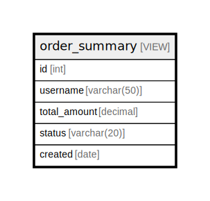

# order_summary

## Description

<details>
<summary><strong>Table Definition</strong></summary>

```sql
CREATE VIEW order_summary AS (
  SELECT o.id, u.username, o.total_amount, o.status, o.created
  FROM orders AS o
  LEFT JOIN users AS u ON u.id = o.user_id
)
```

</details>

## Columns

| Name | Type | Default | Nullable | Children | Parents | Comment |
| ---- | ---- | ------- | -------- | -------- | ------- | ------- |
| id | int |  | false |  |  |  |
| username | varchar(50) |  | true |  |  |  |
| total_amount | decimal |  | false |  |  |  |
| status | varchar(20) |  | false |  |  |  |
| created | date |  | false |  |  |  |

## Referenced Tables

| Name | Columns | Comment | Type |
| ---- | ------- | ------- | ---- |
| [orders](orders.md) | 6 | Customer orders | BASIC TABLE |
| [users](users.md) | 5 | Users table | BASIC TABLE |

## Relations



---

> Generated by [tbls](https://github.com/k1LoW/tbls)
