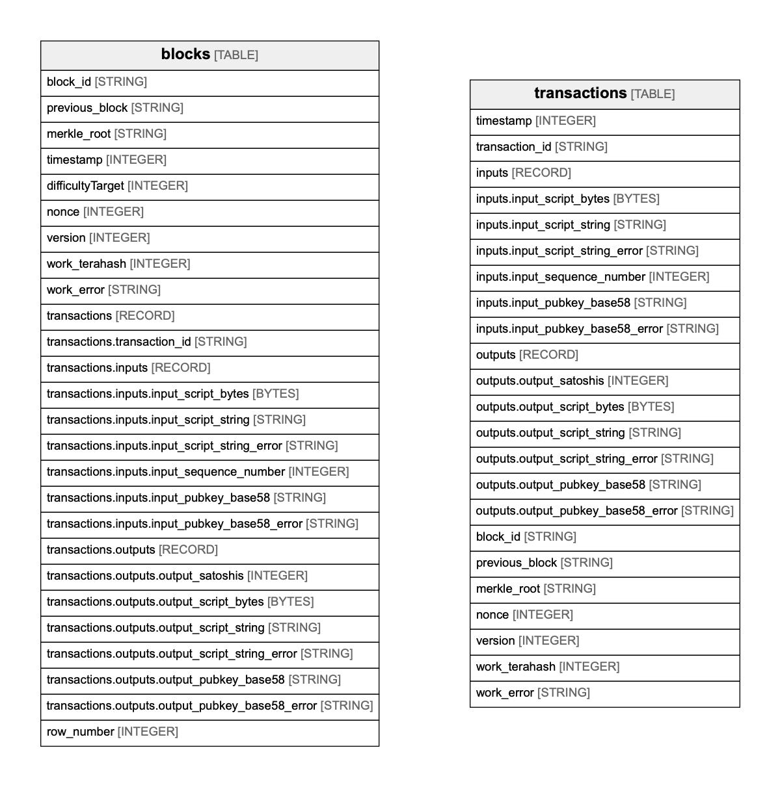

# bigquery-public-data:bitcoin_blockchain

## Tables

| Name | Columns | Comment | Type |
| ---- | ------- | ------- | ---- |
| [blocks](blocks.md) | 26 |  | TABLE |
| [transactions](transactions.md) | 23 |  | TABLE |

## Relations

---

> Generated by [tbls](https://github.com/k1LoW/tbls)
