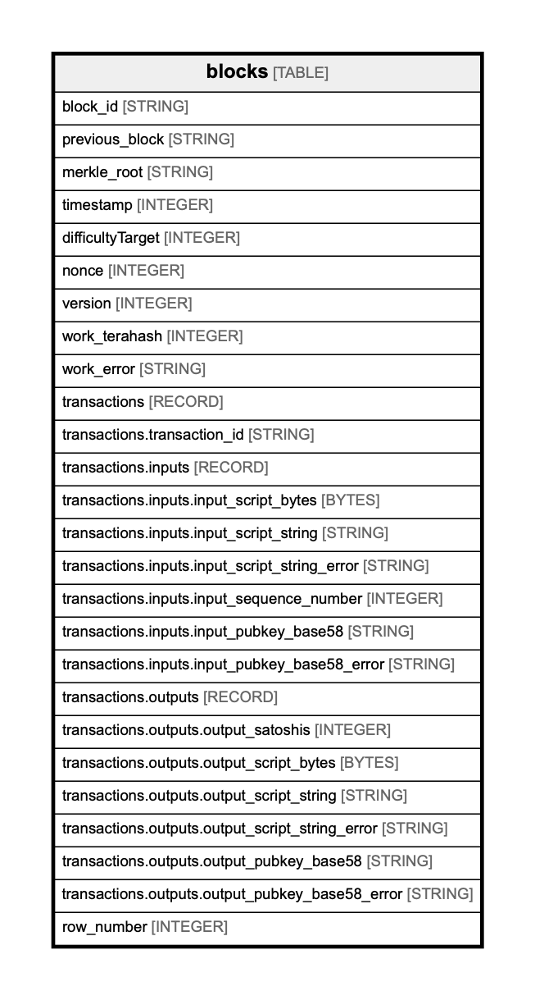

# blocks

## Description

## Columns

| Name | Type | Default | Nullable | Children | Parents | Comment |
| ---- | ---- | ------- | -------- | -------- | ------- | ------- |
| block_id | STRING |  | true | [transactions](transactions.md) |  |  |
| previous_block | STRING |  | true |  |  |  |
| merkle_root | STRING |  | true |  |  |  |
| timestamp | INTEGER |  | true |  |  |  |
| difficultyTarget | INTEGER |  | true |  |  |  |
| nonce | INTEGER |  | true |  |  |  |
| version | INTEGER |  | true |  |  |  |
| work_terahash | INTEGER |  | true |  |  |  |
| work_error | STRING |  | true |  |  |  |
| transactions | RECORD |  | true |  |  |  |
| transactions.transaction_id | STRING |  | true |  | [transactions](transactions.md) |  |
| transactions.inputs | RECORD |  | true |  |  |  |
| transactions.inputs.input_script_bytes | BYTES |  | true |  |  |  |
| transactions.inputs.input_script_string | STRING |  | true |  |  |  |
| transactions.inputs.input_script_string_error | STRING |  | true |  |  |  |
| transactions.inputs.input_sequence_number | INTEGER |  | true |  |  |  |
| transactions.inputs.input_pubkey_base58 | STRING |  | true |  |  |  |
| transactions.inputs.input_pubkey_base58_error | STRING |  | true |  |  |  |
| transactions.outputs | RECORD |  | true |  |  |  |
| transactions.outputs.output_satoshis | INTEGER |  | true |  |  |  |
| transactions.outputs.output_script_bytes | BYTES |  | true |  |  |  |
| transactions.outputs.output_script_string | STRING |  | true |  |  |  |
| transactions.outputs.output_script_string_error | STRING |  | true |  |  |  |
| transactions.outputs.output_pubkey_base58 | STRING |  | true |  |  |  |
| transactions.outputs.output_pubkey_base58_error | STRING |  | true |  |  |  |
| row_number | INTEGER |  | true |  |  |  |

## Relations

---

> Generated by [tbls](https://github.com/k1LoW/tbls)
