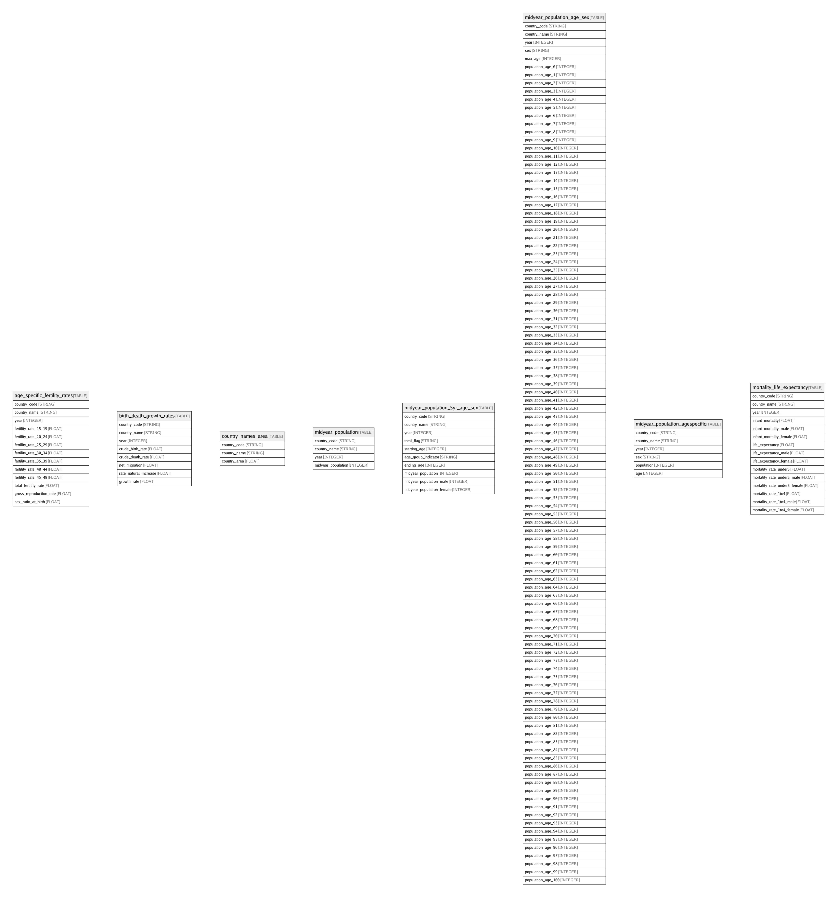

# bigquery-public-data:census_bureau_international

## Description

Overview: The United States Census Bureau’s international dataset provides estimates of country populations since 1950 and projections through 2050. Specifically, the dataset includes midyear population figures broken down by age and gender assignment at birth. Additionally, time-series data is provided for attributes including fertility rates, birth rates, death rates, and migration rates.  
  
Update frequency: Historic (none)  
  
Dataset source: United States Census Bureau  
  
Terms of use: This dataset is publicly available for anyone to use under the following terms provided by the Dataset Source - http://www.data.gov/privacy-policy#data_policy - and is provided "AS IS" without any warranty, express or implied, from Google. Google disclaims all liability for any damages, direct or indirect, resulting from the use of the dataset.  
  
See the GCP Marketplace listing for more details and sample queries: https://console.cloud.google.com/marketplace/details/united-states-census-bureau/international-census-data

## Tables

| Name | Columns | Description | Type |
| ---- | ------- | ------- | ---- |
| [age_specific_fertility_rates](age_specific_fertility_rates.md) | 13 |  | TABLE |
| [birth_death_growth_rates](birth_death_growth_rates.md) | 8 |  | TABLE |
| [country_names_area](country_names_area.md) | 3 |  | TABLE |
| [midyear_population](midyear_population.md) | 4 |  | TABLE |
| [midyear_population_5yr_age_sex](midyear_population_5yr_age_sex.md) | 10 |  | TABLE |
| [midyear_population_age_sex](midyear_population_age_sex.md) | 106 |  | TABLE |
| [midyear_population_agespecific](midyear_population_agespecific.md) | 6 |  | TABLE |
| [mortality_life_expectancy](mortality_life_expectancy.md) | 15 |  | TABLE |

## Relations

---

> Generated by [tbls](https://github.com/k1LoW/tbls)
