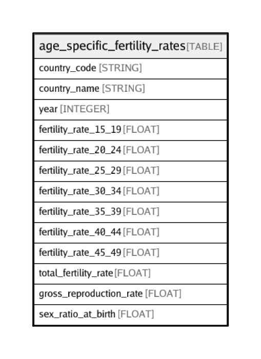

# age_specific_fertility_rates

## Description

## Labels

`freebqcovid:`

## Columns

| Name | Type | Default | Nullable | Children | Parents | Description |
| ---- | ---- | ------- | -------- | -------- | ------- | ------- |
| country_code | STRING |  | false |  |  | Federal Information Processing Standard (FIPS) country/area code |
| country_name | STRING |  | true |  |  | Country or area name |
| year | INTEGER |  | false |  |  | Year |
| fertility_rate_15_19 | FLOAT |  | true |  |  | Age specific fertility rate for age 15-19 (births per 1,000 population) |
| fertility_rate_20_24 | FLOAT |  | true |  |  | Age specific fertility rate for age 20-24 (births per 1,000 population) |
| fertility_rate_25_29 | FLOAT |  | true |  |  | Age specific fertility rate for age 25-29 (births per 1,000 population) |
| fertility_rate_30_34 | FLOAT |  | true |  |  | Age specific fertility rate for age 30-34 (births per 1,000 population) |
| fertility_rate_35_39 | FLOAT |  | true |  |  | Age specific fertility rate for age 35-39 (births per 1,000 population) |
| fertility_rate_40_44 | FLOAT |  | true |  |  | Age specific fertility rate for age 40-44 (births per 1,000 population) |
| fertility_rate_45_49 | FLOAT |  | true |  |  | Age specific fertility rate for age 45-49 (births per 1,000 population) |
| total_fertility_rate | FLOAT |  | true |  |  | Total fertility rate (lifetime births per woman) |
| gross_reproduction_rate | FLOAT |  | true |  |  | Gross reproduction rate (lifetime female births per woman) |
| sex_ratio_at_birth | FLOAT |  | true |  |  | Sex ratio at birth (male births per female birth) |

## Relations

---

> Generated by [tbls](https://github.com/k1LoW/tbls)
