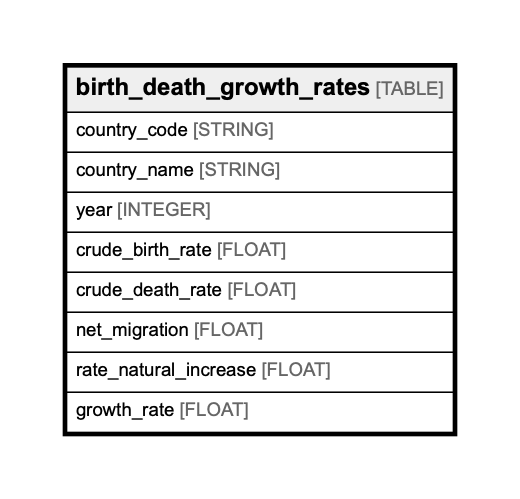

# birth_death_growth_rates

## Description

## Columns

| Name | Type | Default | Nullable | Children | Parents | Comment |
| ---- | ---- | ------- | -------- | -------- | ------- | ------- |
| country_code | STRING |  | false |  |  | Federal Information Processing Standard (FIPS) country/area code |
| country_name | STRING |  | true |  |  | Country or area name |
| year | INTEGER |  | false |  |  | Year |
| crude_birth_rate | FLOAT |  | true |  |  | Crude birth rate (births per 1,000 population) |
| crude_death_rate | FLOAT |  | true |  |  | Crude death rate (deaths per 1,000 population) |
| net_migration | FLOAT |  | true |  |  | Net migration rate (net number of migrants per 1,000 population) |
| rate_natural_increase | FLOAT |  | true |  |  | Rate of natural increase (percent) |
| growth_rate | FLOAT |  | true |  |  | Growth rate (percent) |

## Relations

---

> Generated by [tbls](https://github.com/k1LoW/tbls)
