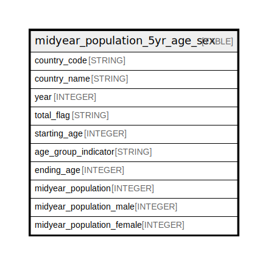

# midyear_population_5yr_age_sex

## Description

## Labels

`freebqcovid:`

## Columns

| Name | Type | Default | Nullable | Children | Parents | Description |
| ---- | ---- | ------- | -------- | -------- | ------- | ----------- |
| country_code | STRING |  | false |  |  | Federal Information Processing Standard (FIPS) country/area code |
| country_name | STRING |  | true |  |  | Country or area name |
| year | INTEGER |  | false |  |  | Year |
| total_flag | STRING |  | true |  |  | Total flag: "*"=Total, all ages; "A"=Individual age group |
| starting_age | INTEGER |  | true |  |  | Starting age (0 to 100) |
| age_group_indicator | STRING |  | true |  |  | Age group indicator: "-"=5-year age group; "+"=open-ended age group |
| ending_age | INTEGER |  | true |  |  | Ending age (4 to 99; set to 0 if G="+") |
| midyear_population | INTEGER |  | true |  |  | Both sexes midyear population in the age group |
| midyear_population_male | INTEGER |  | true |  |  | Male midyear population in the age group |
| midyear_population_female | INTEGER |  | true |  |  | Female midyear population in the age group |

## Relations

---

> Generated by [tbls](https://github.com/k1LoW/tbls)
