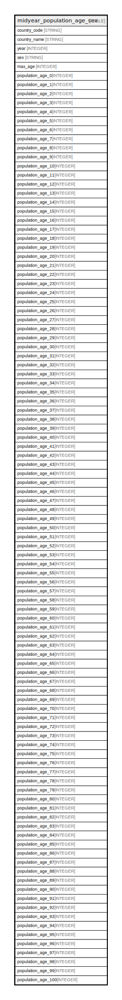

# midyear_population_age_sex

## Description

## Labels

`freebqcovid:`

## Columns

| Name | Type | Default | Nullable | Description |
| ---- | ---- | ------- | -------- | ------- |
| country_code | STRING |  | false | Federal Information Processing Standard (FIPS) country/area code |
| country_name | STRING |  | true | Country or area name |
| year | INTEGER |  | false | Year |
| sex | STRING |  | true | Gender |
| max_age | INTEGER |  | true | The last age in the distribution with a value greater than zero |
| population_age_0 | INTEGER |  | true | Population at Age 0 |
| population_age_1 | INTEGER |  | true | Population at Age 1 |
| population_age_2 | INTEGER |  | true | Population at Age 2 |
| population_age_3 | INTEGER |  | true | Population at Age 3 |
| population_age_4 | INTEGER |  | true | Population at Age 4 |
| population_age_5 | INTEGER |  | true | Population at Age 5 |
| population_age_6 | INTEGER |  | true | Population at Age 6 |
| population_age_7 | INTEGER |  | true | Population at Age 7 |
| population_age_8 | INTEGER |  | true | Population at Age 8 |
| population_age_9 | INTEGER |  | true | Population at Age 9 |
| population_age_10 | INTEGER |  | true | Population at Age 10 |
| population_age_11 | INTEGER |  | true | Population at Age 11 |
| population_age_12 | INTEGER |  | true | Population at Age 12 |
| population_age_13 | INTEGER |  | true | Population at Age 13 |
| population_age_14 | INTEGER |  | true | Population at Age 14 |
| population_age_15 | INTEGER |  | true | Population at Age 15 |
| population_age_16 | INTEGER |  | true | Population at Age 16 |
| population_age_17 | INTEGER |  | true | Population at Age 17 |
| population_age_18 | INTEGER |  | true | Population at Age 18 |
| population_age_19 | INTEGER |  | true | Population at Age 19 |
| population_age_20 | INTEGER |  | true | Population at Age 20 |
| population_age_21 | INTEGER |  | true | Population at Age 21 |
| population_age_22 | INTEGER |  | true | Population at Age 22 |
| population_age_23 | INTEGER |  | true | Population at Age 23 |
| population_age_24 | INTEGER |  | true | Population at Age 24 |
| population_age_25 | INTEGER |  | true | Population at Age 25 |
| population_age_26 | INTEGER |  | true | Population at Age 26 |
| population_age_27 | INTEGER |  | true | Population at Age 27 |
| population_age_28 | INTEGER |  | true | Population at Age 28 |
| population_age_29 | INTEGER |  | true | Population at Age 29 |
| population_age_30 | INTEGER |  | true | Population at Age 30 |
| population_age_31 | INTEGER |  | true | Population at Age 31 |
| population_age_32 | INTEGER |  | true | Population at Age 32 |
| population_age_33 | INTEGER |  | true | Population at Age 33 |
| population_age_34 | INTEGER |  | true | Population at Age 34 |
| population_age_35 | INTEGER |  | true | Population at Age 35 |
| population_age_36 | INTEGER |  | true | Population at Age 36 |
| population_age_37 | INTEGER |  | true | Population at Age 37 |
| population_age_38 | INTEGER |  | true | Population at Age 38 |
| population_age_39 | INTEGER |  | true | Population at Age 39 |
| population_age_40 | INTEGER |  | true | Population at Age 40 |
| population_age_41 | INTEGER |  | true | Population at Age 41 |
| population_age_42 | INTEGER |  | true | Population at Age 42 |
| population_age_43 | INTEGER |  | true | Population at Age 43 |
| population_age_44 | INTEGER |  | true | Population at Age 44 |
| population_age_45 | INTEGER |  | true | Population at Age 45 |
| population_age_46 | INTEGER |  | true | Population at Age 46 |
| population_age_47 | INTEGER |  | true | Population at Age 47 |
| population_age_48 | INTEGER |  | true | Population at Age 48 |
| population_age_49 | INTEGER |  | true | Population at Age 49 |
| population_age_50 | INTEGER |  | true | Population at Age 50 |
| population_age_51 | INTEGER |  | true | Population at Age 51 |
| population_age_52 | INTEGER |  | true | Population at Age 52 |
| population_age_53 | INTEGER |  | true | Population at Age 53 |
| population_age_54 | INTEGER |  | true | Population at Age 54 |
| population_age_55 | INTEGER |  | true | Population at Age 55 |
| population_age_56 | INTEGER |  | true | Population at Age 56 |
| population_age_57 | INTEGER |  | true | Population at Age 57 |
| population_age_58 | INTEGER |  | true | Population at Age 58 |
| population_age_59 | INTEGER |  | true | Population at Age 59 |
| population_age_60 | INTEGER |  | true | Population at Age 60 |
| population_age_61 | INTEGER |  | true | Population at Age 61 |
| population_age_62 | INTEGER |  | true | Population at Age 62 |
| population_age_63 | INTEGER |  | true | Population at Age 63 |
| population_age_64 | INTEGER |  | true | Population at Age 64 |
| population_age_65 | INTEGER |  | true | Population at Age 65 |
| population_age_66 | INTEGER |  | true | Population at Age 66 |
| population_age_67 | INTEGER |  | true | Population at Age 67 |
| population_age_68 | INTEGER |  | true | Population at Age 68 |
| population_age_69 | INTEGER |  | true | Population at Age 69 |
| population_age_70 | INTEGER |  | true | Population at Age 70 |
| population_age_71 | INTEGER |  | true | Population at Age 71 |
| population_age_72 | INTEGER |  | true | Population at Age 72 |
| population_age_73 | INTEGER |  | true | Population at Age 73 |
| population_age_74 | INTEGER |  | true | Population at Age 74 |
| population_age_75 | INTEGER |  | true | Population at Age 75 |
| population_age_76 | INTEGER |  | true | Population at Age 76 |
| population_age_77 | INTEGER |  | true | Population at Age 77 |
| population_age_78 | INTEGER |  | true | Population at Age 78 |
| population_age_79 | INTEGER |  | true | Population at Age 79 |
| population_age_80 | INTEGER |  | true | Population at Age 80 |
| population_age_81 | INTEGER |  | true | Population at Age 81 |
| population_age_82 | INTEGER |  | true | Population at Age 82 |
| population_age_83 | INTEGER |  | true | Population at Age 83 |
| population_age_84 | INTEGER |  | true | Population at Age 84 |
| population_age_85 | INTEGER |  | true | Population at Age 85 |
| population_age_86 | INTEGER |  | true | Population at Age 86 |
| population_age_87 | INTEGER |  | true | Population at Age 87 |
| population_age_88 | INTEGER |  | true | Population at Age 88 |
| population_age_89 | INTEGER |  | true | Population at Age 89 |
| population_age_90 | INTEGER |  | true | Population at Age 90 |
| population_age_91 | INTEGER |  | true | Population at Age 91 |
| population_age_92 | INTEGER |  | true | Population at Age 92 |
| population_age_93 | INTEGER |  | true | Population at Age 93 |
| population_age_94 | INTEGER |  | true | Population at Age 94 |
| population_age_95 | INTEGER |  | true | Population at Age 95 |
| population_age_96 | INTEGER |  | true | Population at Age 96 |
| population_age_97 | INTEGER |  | true | Population at Age 97 |
| population_age_98 | INTEGER |  | true | Population at Age 98 |
| population_age_99 | INTEGER |  | true | Population at Age 99 |
| population_age_100 | INTEGER |  | true | Population at Age 100 |

## Relations

---

> Generated by [tbls](https://github.com/k1LoW/tbls)
