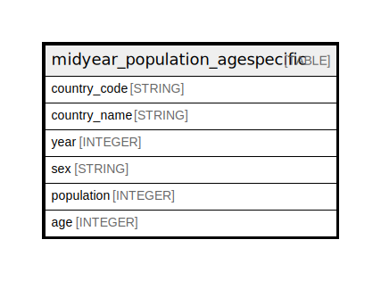

# midyear_population_agespecific

## Description

## Labels

`freebqcovid:`

## Columns

| Name | Type | Default | Nullable | Children | Parents | Description |
| ---- | ---- | ------- | -------- | -------- | ------- | ------- |
| country_code | STRING |  | false |  |  | Federal Information Processing Standard (FIPS) country/area code |
| country_name | STRING |  | true |  |  | Country or area name |
| year | INTEGER |  | false |  |  | Year |
| sex | STRING |  | true |  |  | Gender |
| population | INTEGER |  | true |  |  | Total count of individuals |
| age | INTEGER |  | true |  |  | Age in years |

## Relations

---

> Generated by [tbls](https://github.com/k1LoW/tbls)
