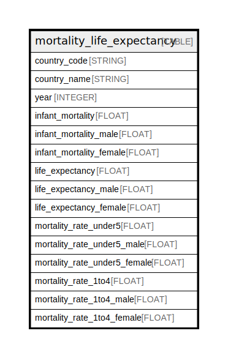

# mortality_life_expectancy

## Description

## Labels

`freebqcovid:`

## Columns

| Name | Type | Default | Nullable | Children | Parents | Description |
| ---- | ---- | ------- | -------- | -------- | ------- | ------- |
| country_code | STRING |  | false |  |  | Federal Information Processing Standard (FIPS) country/area code |
| country_name | STRING |  | true |  |  | Country or area name |
| year | INTEGER |  | false |  |  | Year |
| infant_mortality | FLOAT |  | true |  |  | Both sexes infant mortality rate (infant deaths per 1,000 population) |
| infant_mortality_male | FLOAT |  | true |  |  | Male infant mortality rate (infant deaths per 1,000 population) |
| infant_mortality_female | FLOAT |  | true |  |  | Female infant mortality rate (infant deaths per 1,000 population) |
| life_expectancy | FLOAT |  | true |  |  | Both sexes life expectancy at birth (years) |
| life_expectancy_male | FLOAT |  | true |  |  | Male life expectancy at birth (years) |
| life_expectancy_female | FLOAT |  | true |  |  | Female life expectancy at birth (years) |
| mortality_rate_under5 | FLOAT |  | true |  |  | Both sexes under-5 mortality rate (probability of dying between ages 0 and 5) |
| mortality_rate_under5_male | FLOAT |  | true |  |  | Male sexes under-5 mortality rate (probability of dying between ages 0 and 5) |
| mortality_rate_under5_female | FLOAT |  | true |  |  | Female sexes under-5 mortality rate (probability of dying between ages 0 and 5) |
| mortality_rate_1to4 | FLOAT |  | true |  |  | Both sexes child mortality rate (probability of dying between ages 1 and 4) |
| mortality_rate_1to4_male | FLOAT |  | true |  |  | Male sexes child mortality rate (probability of dying between ages 1 and 4) |
| mortality_rate_1to4_female | FLOAT |  | true |  |  | Female sexes child mortality rate (probability of dying between ages 1 and 4) |

## Relations

---

> Generated by [tbls](https://github.com/k1LoW/tbls)
