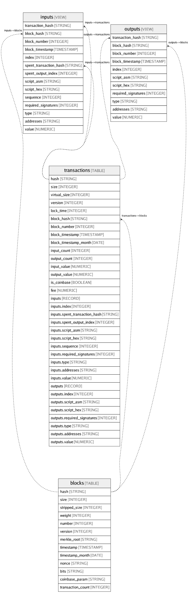

# bigquery-public-data:crypto_bitcoin

## Tables

| Name | Columns | Comment | Type |
| ---- | ------- | ------- | ---- |
| [blocks](blocks.md) | 13 | All blocks. Data is exported using https://github.com/blockchain-etl/bitcoin-etl | TABLE |
| [inputs](inputs.md) | 14 | Inputs from all transactions. Data is exported using https://github.com/blockchain-etl/bitcoin-etl | VIEW |
| [outputs](outputs.md) | 11 | Outputs from all transactions. Data is exported using https://github.com/blockchain-etl/bitcoin-etl | VIEW |
| [transactions](transactions.md) | 34 | All transactions. Data is exported using https://github.com/blockchain-etl/bitcoin-etl  | TABLE |

## Relations

---

> Generated by [tbls](https://github.com/k1LoW/tbls)
