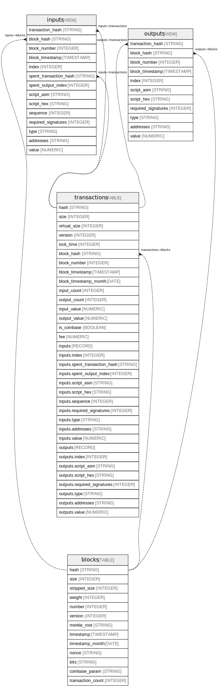

# bigquery-public-data:crypto_bitcoin

## Tables

| Name | Columns | Description | Type | Labels |
| ---- | ------- | ------- | ---- | ------ |
| [blocks](blocks.md) | 13 | All blocks. Data is exported using https://github.com/blockchain-etl/bitcoin-etl | TABLE |  |
| [inputs](inputs.md) | 14 | Inputs from all transactions. Data is exported using https://github.com/blockchain-etl/bitcoin-etl | VIEW |  |
| [outputs](outputs.md) | 11 | Outputs from all transactions. Data is exported using https://github.com/blockchain-etl/bitcoin-etl | VIEW |  |
| [transactions](transactions.md) | 34 | All transactions. Data is exported using https://github.com/blockchain-etl/bitcoin-etl  | TABLE | `dataplex-data-documentation-published-location:us-central1` `dataplex-data-documentation-published-project:vini-gcp-project` `dataplex-data-documentation-published-scan:ab8352e1e-6be2-4e7e-9083-c1412cbada9f` |

## Relations

---

> Generated by [tbls](https://github.com/k1LoW/tbls)
