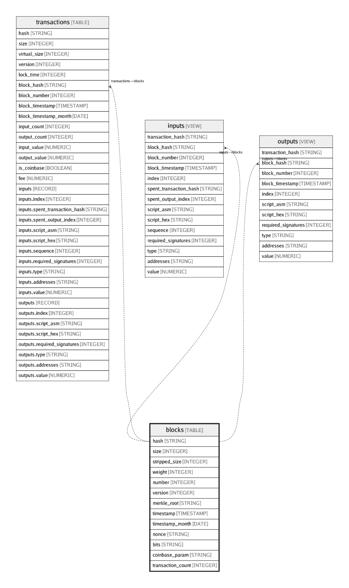

# blocks

## Description

All blocks.  
Data is exported using https://github.com/blockchain-etl/bitcoin-etl

## Columns

| Name | Type | Default | Nullable | Children | Parents | Comment |
| ---- | ---- | ------- | -------- | -------- | ------- | ------- |
| hash | STRING |  | false | [transactions](transactions.md) [inputs](inputs.md) [outputs](outputs.md) |  | Hash of this block |
| size | INTEGER |  | true |  |  | The size of block data in bytes |
| stripped_size | INTEGER |  | true |  |  | The size of block data in bytes excluding witness data |
| weight | INTEGER |  | true |  |  | Three times the base size plus the total size. https://github.com/bitcoin/bips/blob/master/bip-0141.mediawiki |
| number | INTEGER |  | false |  |  | The number of the block |
| version | INTEGER |  | true |  |  | Protocol version specified in block header |
| merkle_root | STRING |  | true |  |  | The root node of a Merkle tree, where leaves are transaction hashes |
| timestamp | TIMESTAMP |  | false |  |  | Block creation timestamp specified in block header |
| timestamp_month | DATE |  | false |  |  | Month of the block creation timestamp specified in block header |
| nonce | STRING |  | true |  |  | Difficulty solution specified in block header |
| bits | STRING |  | true |  |  | Difficulty threshold specified in block header |
| coinbase_param | STRING |  | true |  |  | Data specified in the coinbase transaction of this block |
| transaction_count | INTEGER |  | true |  |  | Number of transactions included in this block |

## Relations

---

> Generated by [tbls](https://github.com/k1LoW/tbls)
