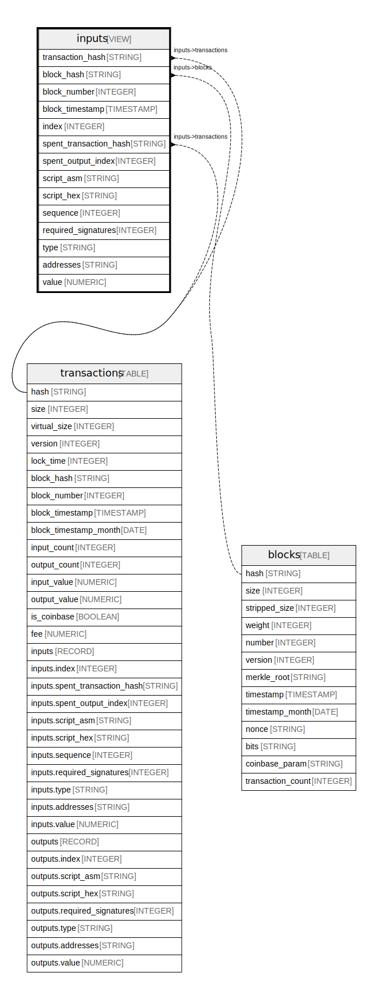

# inputs

## Description

Inputs from all transactions.  
Data is exported using https://github.com/blockchain-etl/bitcoin-etl

<details>
<summary><strong>Table Definition</strong></summary>

```sql
SELECT
    transactions.hash as transaction_hash,
    transactions.block_hash,
    transactions.block_number,
    transactions.block_timestamp,
    inputs.index,
    inputs.spent_transaction_hash,
    inputs.spent_output_index,
    inputs.script_asm,
    inputs.script_hex,
    inputs.sequence,
    inputs.required_signatures,
    inputs.type,
    inputs.addresses,
    inputs.value
FROM `bigquery-public-data.crypto_bitcoin.transactions` as transactions,
    transactions.inputs as inputs
```

</details>

## Columns

| Name | Type | Default | Nullable | Children | Parents | Description |
| ---- | ---- | ------- | -------- | -------- | ------- | ----------- |
| transaction_hash | STRING |  | true |  | [transactions](transactions.md) |  |
| block_hash | STRING |  | true |  | [blocks](blocks.md) |  |
| block_number | INTEGER |  | true |  |  |  |
| block_timestamp | TIMESTAMP |  | true |  |  |  |
| index | INTEGER |  | true |  |  |  |
| spent_transaction_hash | STRING |  | true |  | [transactions](transactions.md) |  |
| spent_output_index | INTEGER |  | true |  |  |  |
| script_asm | STRING |  | true |  |  |  |
| script_hex | STRING |  | true |  |  |  |
| sequence | INTEGER |  | true |  |  |  |
| required_signatures | INTEGER |  | true |  |  |  |
| type | STRING |  | true |  |  |  |
| addresses | STRING |  | true |  |  |  |
| value | NUMERIC |  | true |  |  |  |

## Referenced Tables

| Name | Columns | Description | Type | Labels |
| ---- | ------- | ------- | ---- | ------ |
| [transactions](transactions.md) | 34 | All transactions.<br />Data is exported using https://github.com/blockchain-etl/bitcoin-etl<br /> | TABLE | `dataplex-data-documentation-published-location:us-central1` `dataplex-data-documentation-published-project:vini-gcp-project` `dataplex-data-documentation-published-scan:ab8352e1e-6be2-4e7e-9083-c1412cbada9f` |

## Relations



---

> Generated by [tbls](https://github.com/k1LoW/tbls)
