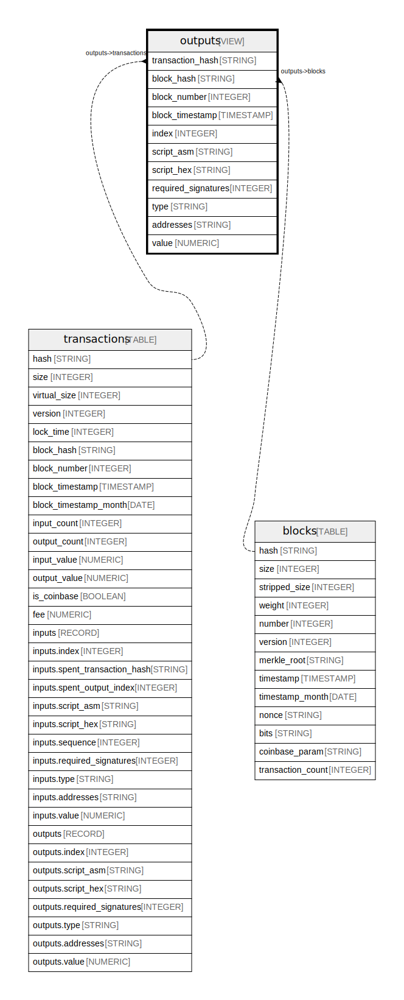

# outputs

## Description

Outputs from all transactions.  
Data is exported using https://github.com/blockchain-etl/bitcoin-etl

<details>
<summary><strong>Table Definition</strong></summary>

```sql
SELECT
    transactions.hash as transaction_hash,
    transactions.block_hash,
    transactions.block_number,
    transactions.block_timestamp,
    outputs.index,
    outputs.script_asm,
    outputs.script_hex,
    outputs.required_signatures,
    outputs.type,
    outputs.addresses,
    outputs.value
FROM `bigquery-public-data.crypto_bitcoin.transactions` as transactions,
    transactions.outputs as outputs
```

</details>

## Columns

| Name | Type | Default | Nullable | Children | Parents | Description |
| ---- | ---- | ------- | -------- | -------- | ------- | ----------- |
| transaction_hash | STRING |  | true |  | [transactions](transactions.md) |  |
| block_hash | STRING |  | true |  | [blocks](blocks.md) |  |
| block_number | INTEGER |  | true |  |  |  |
| block_timestamp | TIMESTAMP |  | true |  |  |  |
| index | INTEGER |  | true |  |  |  |
| script_asm | STRING |  | true |  |  |  |
| script_hex | STRING |  | true |  |  |  |
| required_signatures | INTEGER |  | true |  |  |  |
| type | STRING |  | true |  |  |  |
| addresses | STRING |  | true |  |  |  |
| value | NUMERIC |  | true |  |  |  |

## Referenced Tables

| Name | Columns | Description | Type |
| ---- | ------- | ------- | ---- |
| [transactions](transactions.md) | 34 | All transactions.<br>Data is exported using https://github.com/blockchain-etl/bitcoin-etl<br> | TABLE |

## Relations



---

> Generated by [tbls](https://github.com/k1LoW/tbls)
