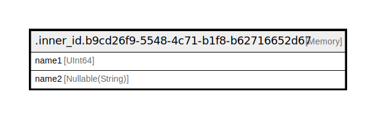

# .inner_id.b9cd26f9-5548-4c71-b1f8-b62716652d67

## Description

<details>
<summary><strong>Table Definition</strong></summary>

```sql
CREATE TABLE testdb.`.inner_id.b9cd26f9-5548-4c71-b1f8-b62716652d67` (`name1` UInt64, `name2` Nullable(String)) ENGINE = Memory
```

</details>

## Columns

| Name | Type | Default | Nullable | Children | Parents | Comment |
| ---- | ---- | ------- | -------- | -------- | ------- | ------- |
| name1 | UInt64 |  | false |  |  |  |
| name2 | Nullable(String) |  | false |  |  |  |

## Relations



---

> Generated by [tbls](https://github.com/k1LoW/tbls)
