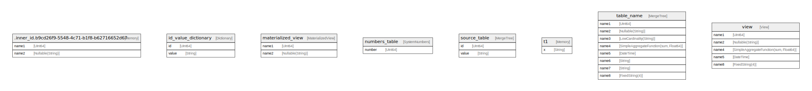

# testdb

## Tables

| Name | Columns | Comment | Type |
| ---- | ------- | ------- | ---- |
| [id_value_dictionary](id_value_dictionary.md) | 2 |  | Dictionary |
| [materialized_view](materialized_view.md) | 2 |  | MaterializedView |
| [numbers_table](numbers_table.md) | 1 |  | SystemNumbers |
| [source_table](source_table.md) | 2 |  | MergeTree |
| [t1](t1.md) | 1 |  | Memory |
| [table_name](table_name.md) | 8 | comment for table | MergeTree |
| [view](view.md) | 5 |  | View |

## Stored procedures and functions

| Name | ReturnType | Arguments | Type |
| ---- | ------- | ------- | ---- |
| linear_equation |  |  |  |

## Relations

---

> Generated by [tbls](https://github.com/k1LoW/tbls)
