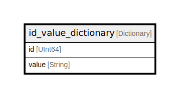

# id_value_dictionary

## Description

<details>
<summary><strong>Table Definition</strong></summary>

```sql
CREATE DICTIONARY testdb.id_value_dictionary (`id` UInt64, `value` String) PRIMARY KEY id SOURCE(CLICKHOUSE(TABLE 'source_table')) LIFETIME(MIN 0 MAX 1000) LAYOUT(FLAT())
```

</details>

## Columns

| Name | Type | Default | Nullable | Children | Parents | Comment |
| ---- | ---- | ------- | -------- | -------- | ------- | ------- |
| id | UInt64 |  | false |  |  |  |
| value | String |  | false |  |  |  |

## Relations



---

> Generated by [tbls](https://github.com/k1LoW/tbls)
