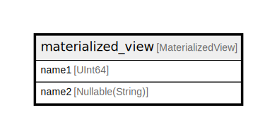

# materialized_view

## Description

<details>
<summary><strong>Table Definition</strong></summary>

```sql
CREATE MATERIALIZED VIEW testdb.materialized_view (`name1` UInt64, `name2` Nullable(String)) ENGINE = Memory AS SELECT name1, name2 FROM testdb.table_name ORDER BY name1 DESC
```

</details>

## Columns

| Name | Type | Default | Nullable | Children | Parents | Comment |
| ---- | ---- | ------- | -------- | -------- | ------- | ------- |
| name1 | UInt64 |  | false |  |  |  |
| name2 | Nullable(String) |  | false |  |  |  |

## Referenced Tables

| Name | Columns | Comment | Type |
| ---- | ------- | ------- | ---- |
| [table_name](table_name.md) | 8 | comment for table | MergeTree |

## Relations



---

> Generated by [tbls](https://github.com/k1LoW/tbls)
