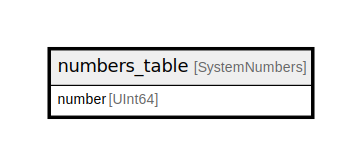

# numbers_table

## Description

<details>
<summary><strong>Table Definition</strong></summary>

```sql
CREATE TABLE testdb.numbers_table (`number` UInt64) AS numbers(100)
```

</details>

## Columns

| Name | Type | Default | Nullable | Children | Parents | Comment |
| ---- | ---- | ------- | -------- | -------- | ------- | ------- |
| number | UInt64 |  | false |  |  |  |

## Relations



---

> Generated by [tbls](https://github.com/k1LoW/tbls)
