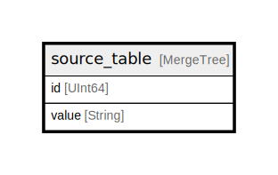

# source_table

## Description

<details>
<summary><strong>Table Definition</strong></summary>

```sql
CREATE TABLE testdb.source_table (`id` UInt64, `value` String) ENGINE = MergeTree PRIMARY KEY id ORDER BY id SETTINGS index_granularity = 8192
```

</details>

## Columns

| Name | Type | Default | Nullable | Children | Parents | Comment |
| ---- | ---- | ------- | -------- | -------- | ------- | ------- |
| id | UInt64 |  | false |  |  |  |
| value | String |  | false |  |  |  |

## Constraints

| Name | Type | Definition |
| ---- | ---- | ---------- |
| sorting key | SORTING KEY | ORDER BY (id) |
| primary key | PRIMARY KEY | PRIMARY KEY (id) |

## Relations



---

> Generated by [tbls](https://github.com/k1LoW/tbls)
