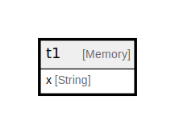

# t1

## Description

<details>
<summary><strong>Table Definition</strong></summary>

```sql
CREATE TABLE testdb.t1 (`x` String) ENGINE = Memory
```

</details>

## Columns

| Name | Type | Default | Nullable | Children | Parents | Comment |
| ---- | ---- | ------- | -------- | -------- | ------- | ------- |
| x | String |  | false |  |  |  |

## Relations



---

> Generated by [tbls](https://github.com/k1LoW/tbls)
