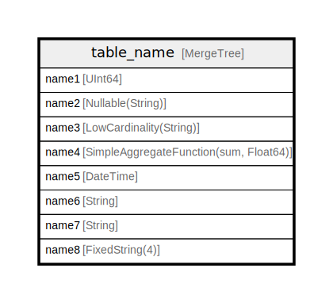

# table_name

## Description

comment for table

<details>
<summary><strong>Table Definition</strong></summary>

```sql
CREATE TABLE testdb.table_name (`name1` UInt64 COMMENT 'comment for column 1', `name2` Nullable(String) DEFAULT 'column 2' COMMENT 'comment for column 2' CODEC(ZSTD(1)), `name3` LowCardinality(String) MATERIALIZED upper(name2) COMMENT 'comment for column 3', `name4` SimpleAggregateFunction(sum, Float64) TTL name5 + toIntervalDay(1), `name5` DateTime DEFAULT now(), `name6` String ALIAS formatReadableSize(name1), `name7` String MATERIALIZED hex(name1), `name8` FixedString(4) DEFAULT unhex(name7), INDEX idx1 name1 TYPE bloom_filter(0.01) GRANULARITY 1, INDEX idx2 name1 * 2 TYPE minmax GRANULARITY 3, INDEX idx3 name1 * length(name2) TYPE set(1000) GRANULARITY 4, PROJECTION projection_name_1 (SELECT name1, name2, name3 ORDER BY name1)) ENGINE = MergeTree PARTITION BY (name1, name3, name5) PRIMARY KEY (name1, name5) ORDER BY (name1, name5) SAMPLE BY name1 SETTINGS index_granularity = 8192 COMMENT 'comment for table'
```

</details>

## Columns

| Name | Type | Default | Nullable | Children | Parents | Comment |
| ---- | ---- | ------- | -------- | -------- | ------- | ------- |
| name1 | UInt64 |  | false |  |  | comment for column 1 |
| name2 | Nullable(String) | DEFAULT 'column 2' | false |  |  | comment for column 2 |
| name3 | LowCardinality(String) | MATERIALIZED upper(name2) | false |  |  | comment for column 3 |
| name4 | SimpleAggregateFunction(sum, Float64) |  | false |  |  |  |
| name5 | DateTime | DEFAULT now() | false |  |  |  |
| name6 | String | ALIAS formatReadableSize(name1) | false |  |  |  |
| name7 | String | MATERIALIZED hex(name1) | false |  |  |  |
| name8 | FixedString(4) | DEFAULT unhex(name7) | false |  |  |  |

## Constraints

| Name | Type | Definition |
| ---- | ---- | ---------- |
| partition key | PARTITION KEY | PARTITION BY ((name1, name3, name5)) |
| sorting key | SORTING KEY | ORDER BY (name1, name5) |
| primary key | PRIMARY KEY | PRIMARY KEY (name1, name5) |
| sampling key | SAMPLING KEY | SAMPLE BY (name1) |

## Indexes

| Name | Definition |
| ---- | ---------- |
| idx1 | bloom_filter(0.01) |
| idx2 | minmax |
| idx3 | set(1000) |

## Relations



---

> Generated by [tbls](https://github.com/k1LoW/tbls)
