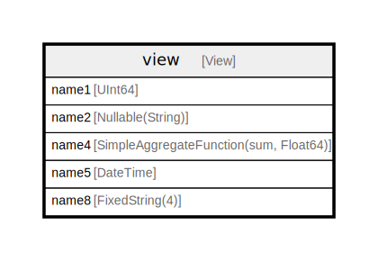

# view

## Description

<details>
<summary><strong>Table Definition</strong></summary>

```sql
CREATE VIEW testdb.view (`name1` UInt64, `name2` Nullable(String), `name4` SimpleAggregateFunction(sum, Float64), `name5` DateTime, `name8` FixedString(4)) AS SELECT * FROM testdb.table_name
```

</details>

## Columns

| Name | Type | Default | Nullable | Children | Parents | Comment |
| ---- | ---- | ------- | -------- | -------- | ------- | ------- |
| name1 | UInt64 |  | false |  |  |  |
| name2 | Nullable(String) |  | false |  |  |  |
| name4 | SimpleAggregateFunction(sum, Float64) |  | false |  |  |  |
| name5 | DateTime |  | false |  |  |  |
| name8 | FixedString(4) |  | false |  |  |  |

## Relations



---

> Generated by [tbls](https://github.com/k1LoW/tbls)
