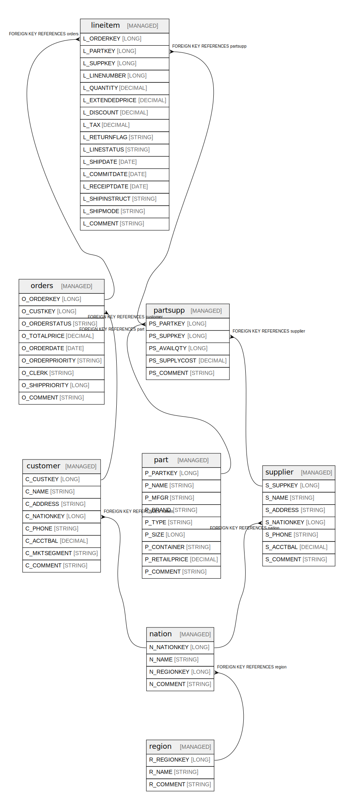

# workspace.tpch_sf1

## Tables

| Name | Columns | Comment | Type |
| ---- | ------- | ------- | ---- |
| [customer](customer.md) | 8 | Customer information including demographics and account details | MANAGED |
| [lineitem](lineitem.md) | 16 | Individual line items within orders, including pricing, shipping, and part details | MANAGED |
| [nation](nation.md) | 4 | Countries/nations with their associated regions | MANAGED |
| [orders](orders.md) | 9 | Customer orders with status, pricing, and processing information | MANAGED |
| [part](part.md) | 9 | Parts catalog with manufacturing and pricing information | MANAGED |
| [partsupp](partsupp.md) | 5 | Association of parts with suppliers including available quantity and cost | MANAGED |
| [region](region.md) | 3 | Geographic regions containing nations | MANAGED |
| [supplier](supplier.md) | 7 | Suppliers with contact and account information | MANAGED |

## Relations

---

> Generated by [tbls](https://github.com/k1LoW/tbls)
